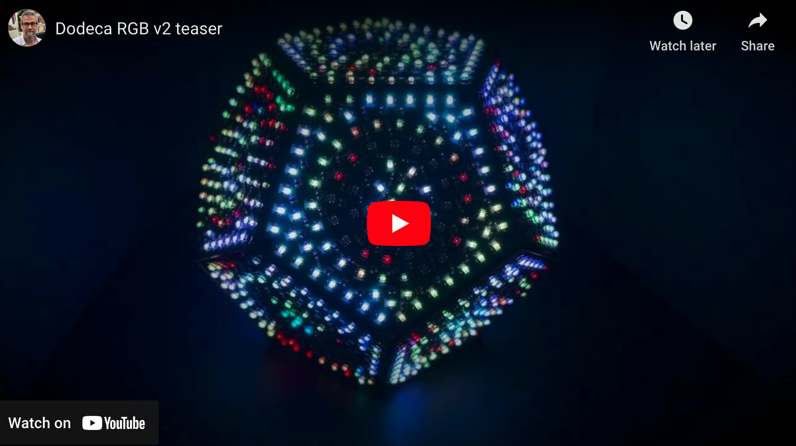
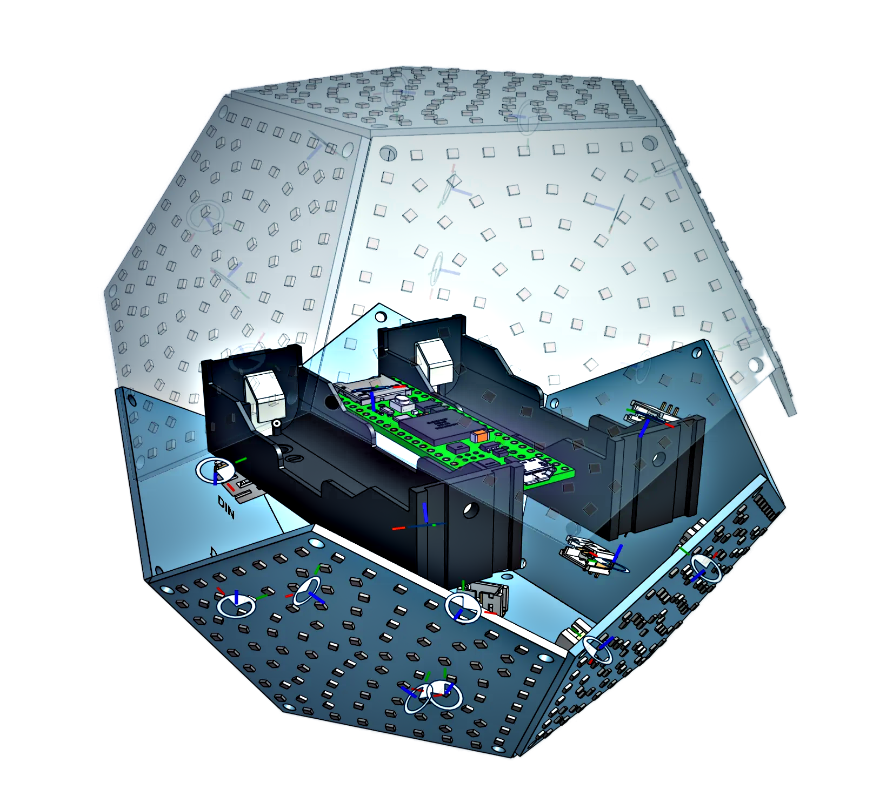
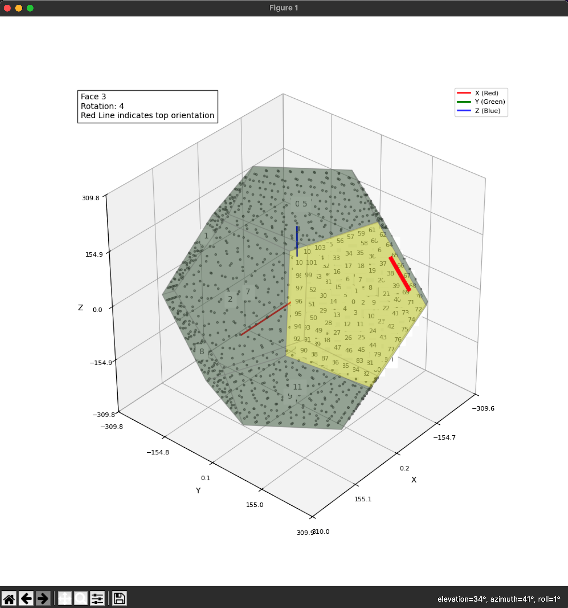

# DodecaRGB V2

Dec 2024: *V2 in development!* Version two introduces higher density micro-pixels (1248 in total!) and a slightly smaller size overall. Click below to see a teaser video.

[](https://www.youtube.com/watch?v=RErgt5O7D7U)

## Vision

Create a powerful open-source animation and interaction platform for running resolution-indpendent apps on portable, interactive 3D physical models.

## Realization

DodecaRGB V2 is a powerful, modular, high-resolution programmable blinky gadget that was made for the hacker community, especially for coders that want to do spherical animations. Typically, this is quite hard - you either need to make a spinning POV globe, or wire up custom solutions - not to mention power and performance challenges.

This project aims to create a standard platform for resolution-indpendent animations based on spherical models. DodecaRGB V2 is the second iteration of this platform, and serves as a reference implementation.

The firmware, 3d models and tooling are open source and free to use and modify. The hardware PCBs will are planned as a kit for 2025, which will include most of the parts needed to 3d print and assemble your own.

## The Reference Model

- We have a dodecahedron model with 12 sides.
- Each side is a pentgon-shaped PCB circuit board that contains 104 RGB leds.
- Each side connects to the next, in series, for a grand total of 1248 LEDs.
- The whole thing runs at >50fps, and can be battery powered
- Portable and interactive: features like wireless charging, orientation sensor, magnetic closing, 3d printed interior.
- Other ideas may extend the model (touch sensitivity, sound reactive, etc)

The combination of a hand-held ball of LEDs with motion sensing opens a lot of interesting user interaction experiments: motion light performances, visualizing data, interactive games, puzzles, etc. This reference platform is intended to be availabe as a kit for 2025, but the implementation is open source and could be applied to other models with different shapes and LED layouts.


## The Hardware

**Note: These are prototypes, and the final hardware will be a bit more *refined and tested*.**

- 2-layer PCBs with the WS2812 LEDs (SMD 1615 package), decoupling capacitors and connectors
- A Teensy 4.1 microcontroller is used to control everything
- Level shifters (for LEDs), power regulation, battery, etc.
- FastLED parallel support is being used (see <https://github.com/FastLED/FastLED/releases/tag/3.9.9>)
- The two hemispheres of the model are wired on separate channels, using pins 19 and 18 of the Teensy, so 624 LEDs per channel. This allows for higher frame rates.

- [v2 - level shifters](images/level-shifter.jpeg)
- [v2 - teensy 4.1 wiring](images/teensy-41.jpeg)
- [v2 - prototype internal wiring](images/prototype-internal.jpeg)


In the final design, all of these components will be integrated into stackable PCBs designed to fit together like a puzzle. These would contain sensors, level shifters, power management, dual 18650 battery holders, and wireless charging. The Teensy will be mounted directly to this PCB.



## The Software

The firmware is built in C++ using the Arduino framework and FastLED library. In general, animations are resolution-independent and are implemented like shaders (given a pixel, what color should it be?).

- **Firmware**: C++ code running on the Teensy 4.1
  - FastLED for LED control with parallel output support
  - Object-oriented animation framework
  - Pre-calculated LED positions and neighbor distances
  - IMU support for motion-reactive features

- **Python Utilities** (`util/` directory):
  - 3D visualization tool for development and testing
  - LED coordinate generation from PCB pick-and-place files
  - Neighbor distance calculations and validation
  - Unit tests for all core functionality

The LED positions are generated from the PCB pick-and-place files, transformed into 3D space, and exported as C++ code. The visualizer helps verify the positions and side configurations before generating the final code. This makes cool animations easier to create.

Each LED point knows its:

- 3D coordinates (x, y, z)
- Which face it belongs to (0-11)
- Its nearest neighbors and their distances
- Original PCB position and label

There is a [developer overview](Development.md) as well asdocumentation on [creating animations](creating_animations.md).

## Testing

The project includes unit tests for the Python utilities. To run the tests:

First, ensure you have all requirements installed:

```bash
pip install -r util/requirements.txt
```

1. From the project root directory:

```bash
PYTHONPATH=. python -m util.tests.run_tests
```

This will run all tests and show detailed output. Tests are located in the `util/tests` directory and include:

- Matrix3D transformations
- LED point calculations
- PCB data loading
- Core utility functions

Pull requests are welcome!

## TODOs

### 🚧 In Progress

- 📱 Motion-reactive support
  - Evaluating different IMU choices
  - Investigating orientation and sensitivity options
  - Planning gesture support (tap, shake, spin, etc.)
- 🎨 3D modelling of interior structure
- 🔌 Motherboard PCB development
  - Teensy 4.1 mounting
  - 2x 18650 battery integration
  - Power and charging circuits
  - Level shifting
  - Sensor integration

### 🎯 Future Plans

- 🔋 Wireless charging (Qi)
  - Testing larger coils
  - Optimizing PCB thickness
- 🖼️ Image loading support
  - Per-side images
  - Mapping projections for globes and spherical photos
- ⚡ Hardware optimizations
  - Optimize wiring
  - Improve connector pad arrangement
- 📝 Documentation
  - Step-by-step assembly instructions with photos
  - Video tutorial

### ✅ Completed

- ✓ Refactoring animations into modules
  - Isolated and standardized interfaces
  - Simplified playlist and animation creation
- ✓ Migrated coordinate and code generation to Python utilities
- ✓ Added unit tests for Python utilities

### Version 1 (2023)

For info and assembly instructions for version 1, see [the archived readme](Dodeca-V1-info.md).

## Development Tools

Documentation about doing development with this project is available in [Development.md](Development.md).

The python utilities are documented in [util/README.md](util/README.md). This includes how to generate the LED coordinates and visualizer from the PCB pick-and-place files, along with unit tests for the utilities.

### 3D Visualizer

The project includes a 3D visualizer tool to help with development and testing, and ensuring that the side configuration and point positions are correct at export time.



Please see the [utils README.md](util/README.md) for more information.
