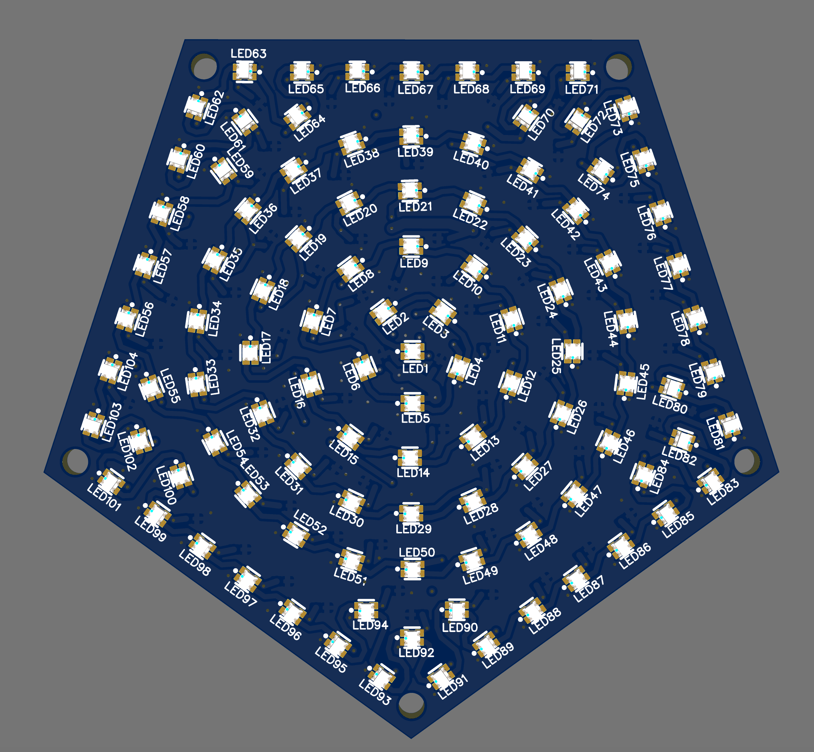

# Creating Animations

This short guide was made to help you create your own animations for the DodecaRGB. 

The project is built in C++ and uses the Arduino framework, FastLED, and several other libraries. In general, common patterns around the stdlib are use, such as std::string, std::vector, std::map, std::unique_ptr, etc. In addition the Eigen library is used for linear algebra. PlatformIO or Cursor IDE are assumed for development.

The DodecaRGB firmware can load multiple animations and switch between them. Each animation is like a small shader program - it runs every frame and updates the LED colors based where it is on the display. This happens 50+ times per second, and the addressable LEDs are updated in parallel. The animation framework provides common functionality and patterns for defining animations, handling settings, presets, playlists, color palettes, status messages, and more.

The framework follows a simple structure: `Animation` (base class) ← `YourAnimation` (implementation) ← `AnimationManager` (controls flow) with `AnimationParams` for configuration.

## Getting Started

Animations work through a simple lifecycle: they're registered with the system, initialized with parameters, and then their `tick()` function is called every frame to update the LEDs. The `tick()` function should be fast and efficient, typically just looping through the LEDs to update their colors. Think of it like a shader - it's called frequently and needs to be performant.

Here's how things are structured in the source tree:

```text
project_root/
├── include/
│   └── animations/
│       └── fadein.h            # Your new animation's header file
└── src/
    ├── animation_builder.cpp   # Register your animation here
    └── animations/
        └── fadein.cpp          # Your new animation's implementation file
```

Steps to register your animation:

In `animation_builder.cpp`:

```cpp
#include "animations/fadein.h"

// ...

REGISTER_ANIMATION("fadein", FadeIn)
```

In `main.cpp`:

```cpp
animation_manager.add("fadein");
```

## Implementing an Animation

Each animation needs a header and implementation file. Here's a basic example:

```cpp
// fadein.h
class FadeIn : public Animation {
  private:
    float speed;
    uint32_t counter = 0;
    CRGBPalette16 palette;

  public:
    void init(const AnimParams& params) override;
    void tick() override;
    String getStatus() const override;
    const char* getName() const override { return "fadein"; }
};
```

```cpp
// fadein.cpp
void FadeIn::init(const AnimParams& params) {
    speed = params.getFloat("speed", 1.0f);
    palette = params.getPalette("palette", RainbowColors_p);
}

void FadeIn::tick() {
    fadeToBlackBy(leds, numLeds(), 40);  // Prevent brightness accumulation
    
    float position = counter * speed;
    for(int i = 0; i < numLeds(); i++) {
        CRGB color = ColorFromPalette(palette, 
            position + i * 16,    // Offset each LED
            sin8(position));      // Modulate brightness
        nblend(leds[i], color, 128);
    }
    counter++;
}

String FadeIn::getStatus() const {
    output.printf("Speed: %.2f Pos: %.1f\n", speed, float(counter * speed));
    output.print(getAnsiColorString(leds[0]));
    return output.get();
}
```

## Working with Parameters

Animation parameters allow customization through key-value storage. This is useful when you have an animation that can be used in different ways. Here's how to define and use them:

```cpp
// In animations/myanimation.h
class MyAnimation : public Animation {
private:
    float _speed;
    int _brightness;
    CRGBPalette16 _palette;

public:
    AnimParams getDefaultParams() override {
        return {
            {"speed", "1.0"},
            {"brightness", "255"},
            {"palette", "RainbowColors_p"}
        };
    }

    void init(const AnimParams& params) override {
        _speed = params.getFloat("speed", 1.0f);
        _brightness = params.getInt("brightness", 255);
        _palette = params.getPalette("palette", RainbowColors_p);
    }
};

// In main.cpp or where you set up animations
animation_manager.add("myanimation");  // Uses default parameters

// Or with a specific preset
animation_manager.preset("myanimation", "fast", {
    {"speed", "2.5"},
    {"brightness", "200"}
});
```

Each animation can define its default parameters in `getDefaultParams()`, and these can be overridden when adding the animation to the manager or by applying presets later.

## Color Palettes

Three default palettes are available:

- `basePalette`: Rich, saturated colors
- `highlightPalette`: Bright, light colors
- `uniquePalette`: Distinct, high-contrast colors

Helper functions for color management:

```cpp
String colorName = getClosestColorName(CRGB(255, 0, 0));  // Returns "Red"
String ansiColor = getAnsiColorString(CRGB::Red);         // Terminal color
float brightness = get_perceived_brightness(color);
```

## Animation Playback and Playlists

In main.cpp, you define your animation playlist and control how animations play back. Here's how to set up and control animations:

```cpp
// In main.cpp - Build your playlist
animation_manager.add("rainbow");     // Uses default parameters
animation_manager.add("sparkle");     // Uses default parameters

// Customize an animation with a preset
animation_manager.preset("rainbow", "fast", {
    {"speed", "2.0"},
    {"brightness", "200"}
});

// Control playback behavior
animation_manager.setPlaybackMode(PlaybackMode::HOLD);        // Stay on current (default)
animation_manager.setPlaybackMode(PlaybackMode::ADVANCE, 30); // Next every 30 seconds
animation_manager.setPlaybackMode(PlaybackMode::RANDOM, 15);  // Random every 15 seconds

// Manual control is always available
animation_manager.nextAnimation();           // Go to next
animation_manager.randomAnimation();         // Jump to random
animation_manager.setCurrentAnimation(2);    // Jump to specific index
animation_manager.setCurrentAnimation("rainbow"); // Jump to named animation

// Query current state
String current = animation_manager.getCurrentAnimationName();
String status = animation_manager.getCurrentStatus();
size_t index = animation_manager.getCurrentAnimationIndex();
size_t count = animation_manager.getPlaylistLength();
```

### Playback Modes

- `HOLD`: Stays on current animation until manually changed (default)
- `ADVANCE`: Automatically advances through playlist in order
- `RANDOM`: Randomly selects next animation from playlist

The second parameter to `setPlaybackMode()` specifies the hold time in seconds. A hold time of 0 means manual advancement only.

This system makes it easy to create dynamic displays that automatically cycle through animations, or to build interactive controls that manually advance through the playlist.

## Best Practices

### LED Management

- Access LEDs directly through `leds[]` array
- Framework handles `FastLED.show()` calls
- Use `fadeToBlackBy()` or `nscale8()` to manage brightness
- `nblend()` for safe color mixing

### Animation Flow

- Track time with counters or `millis()`
- Make speed adjustable via parameters
- No `delay()` calls in `tick()`
- Pre-calculate values in `init()`

### Layout Constants

- `numLeds()`: Total LEDs
- `leds_per_side`: LEDs per face
- `num_sides`: Number of faces (12)

### Status Reporting

The Animation base class provides an `output` object for building status messages that appear in the serial terminal:

```cpp
String getStatus() const override {
    // Basic info with printf-style formatting
    output.printf("Speed: %.2f\n", _speed);
    
    // Color previews with ANSI codes
    output.print(getAnsiColorString(_primary_color));
    output.printf(" Primary: %s\n", getClosestColorName(_primary_color).c_str());
    
    return output.get();  // Returns and clears buffer
}
```

The `output` object supports printf-style formatting, print/println, and automatic buffer management. There are also helper functions for color previews via `getAnsiColorString()`, and color name lookup via `getClosestColorName()`.

### Working with Neighbors

Each LED in the `points[]` array has pre-calculated neighbor data, allowing for fast implementation of effects that spread across the surface:

```cpp
void createRipple(int center_led, float radius) {
    for (const auto& neighbor : points[center_led].neighbors) {
        if (neighbor.distance <= radius) {
            float brightness = 255 * (1.0f - neighbor.distance/radius);
            leds[neighbor.led_number].fadeToBlackBy(255 - brightness);
        }
    }
}
```

### Distance Calculations

The `points[]` array provides distance calculation methods for creating spatial effects. For performance, calculate distances once during initialization when possible:

```cpp
class WaveAnimation : public Animation {
private:
    std::vector<float> _distances;
    
    void init(const AnimParams& params) override {
        // Pre-calculate distances from center
        _distances.resize(NUM_LEDS);
        for (int i = 0; i < NUM_LEDS; i++) {
            _distances[i] = points[i].distance_to(
                points[NUM_LEDS/2].x,
                points[NUM_LEDS/2].y,
                points[NUM_LEDS/2].z
            );
        }
    }
    
    void tick() override {
        for (int i = 0; i < NUM_LEDS; i++) {
            float wave = sin(_counter * _speed - _distances[i]);
            leds[i] = CHSV(_distances[i] * 5, 255, wave * 255);
        }
    }
};
```

## Animation Strategies

### Time and Motion

```cpp
class WaveAnimation : public Animation {
private:
    float speed;
    uint32_t counter = 0;
    
public:
    void init(const AnimParams& params) override {
        speed = params.getFloat("speed", 1.0f);  // Adjustable speed
    }
    
    void tick() override {
        float timePosition = counter * speed;  // Smooth time-based motion
        
        for(int i = 0; i < numLeds(); i++) {
            // Create wave pattern using time
            uint8_t brightness = sin8(timePosition + i * 16);
            leds[i] = CRGB(brightness, brightness, brightness);
        }
        counter++;
    }
};
```

### Palette-Based Colors

```cpp
class PaletteWave : public Animation {
private:
    CRGBPalette16 palette;
    uint32_t counter = 0;
    
public:
    void init(const AnimParams& params) override {
        // Get palette parameter or use default
        palette = params.getPalette("palette", RainbowColors_p);
    }
    
    void tick() override {
        // Clear previous frame
        fadeToBlackBy(leds, numLeds(), 40);
        
        for(int i = 0; i < numLeds(); i++) {
            // Use palette to create smooth color transitions
            uint8_t colorIndex = counter + i * 2;
            uint8_t brightness = sin8(counter + i * 4);
            CRGB color = ColorFromPalette(palette, colorIndex, brightness);
            leds[i] = color;
        }
        counter++;
    }
};
```

### Random Effects

The animation framework automatically seeds both the system random number generator and FastLED's random functions during setup() using hardware entropy from the microcontroller, so you don't need to call random.seed() or random16_set_seed() in your animations.

```cpp
void sparkleEffect() {
    // Add random sparkles to each face
    for(int face = 0; face < num_sides; face++) {
        if(random8() < 40) {  // 40/255 chance per face
            int led = (face * leds_per_side) + random8(leds_per_side);
            leds[led] = CRGB::White;
        }
    }
    // Fade all LEDs each frame
    fadeToBlackBy(leds, numLeds(), 64);
}
```

## Coordinate Systems

The DodecaRGB provides several ways to address LEDs spatially:

### Linear Addressing

The LEDs of each PCB are laid out roughly in a spiral pattern, starting in the center and radiating outwards. Each side connects to the next, so all 12 sides are connected to each other in a single array.

Basic sequential access:

```cpp
for(int i = 0; i < numLeds(); i++) {
    leds[i] = CHSV(i * 256/numLeds(), 255, 255);  // Hue varies smoothly across LEDs
}
```



### Face-Based Rendering

```cpp
void renderByFace() {
    for(int face = 0; face < num_sides; face++) {
        // Calculate LED range for this face
        int start = face * leds_per_side;
        int end = start + leds_per_side;
        
        // Example: alternate faces between two colors
        CRGB faceColor = (face % 2 == 0) ? CRGB::Red : CRGB::Blue;
        fill_solid(leds[start], leds_per_side, faceColor);
    }
}
```

### 3D Coordinates

Each LED has a mapped position using the `points[]` array. All of the 3D positions of each LED of the DodecaRGB model have been pre-calculated and are available to animation code.

```cpp
// Access x,y,z coordinates of any LED
float x = points[i].x;
float y = points[i].y;
float z = points[i].z;

// Find LEDs near a point in space
for(int i = 0; i < numLeds(); i++) {
    float dist = points[i].distance_to(target_x, target_y, target_z);
    if(dist < threshold) {
        leds[i] = CRGB::White;
    }
}
```


### Spherical Coordinates

With the x,y,z coordinates in place we can use spherical coordidnates to animate objecgts in a spherical space. This is useful for orbital effects (as seen in Blob animation):

```cpp
// Convert angle and elevation to position
float azimuth = counter * 0.01;          // Horizontal angle
float elevation = PI/2;                  // Vertical angle (0=top, PI=bottom)
float radius = sphere_radius;            // Distance from center

// Convert to cartesian
float x = radius * sin(elevation) * cos(azimuth);
float y = radius * sin(elevation) * sin(azimuth);
float z = radius * cos(elevation);

// Light LEDs near this position
for(int i = 0; i < numLeds(); i++) {
    if(points[i].distance_to(x, y, z) < radius) {
        leds[i] = CRGB::Blue;
    }
}
```

It helps to imagine a sphere inscribed in the DodecaRGB, with the center of the sphere at the center of the DodecaRGB. The `points[]` array contains the 3D coordinates of each LED in this sphere.


See the `Blob` animation for an example of orbital movement using spherical coordinates, and `XYZScanner` for cartesian coordinate scanning effects.
