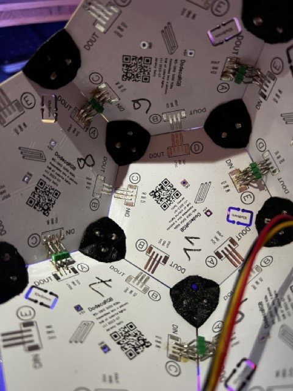

# DodecaRGB V1 info 

**Note: This is the archive of the first version, made for CCC camp 2023.**

This is the firmware for DodecaRGB, a colorful DIY IoT model 12-sided shape made from PCB circuit boards adorned with bright LEDs. It can be assembled as a desktop light, or built with a battery pack and motion sensors for reactive animations and games.

## Hardware

We have a dodecahedron model with 12 sides. Each side is a pentgon-shaped PCB circuit board with RGB LEDs arranged on them, spaced evenly.

An ESP32 microcontroller is used to run the device, built in C++ with the Arduino environment and FastLED library.

Each pentagon side contains 26 RGB leds on a circuit board, arranged in the following way:

- 1 central LED in the exact middle of each side
- a ring of 10 LEDs in a circle around the central LED
- 15 LEDs around the edges, in groups of 3, spaced evenly around the edge of the pentagon

The LEDs on each face of the dodecahedron are wired in series so that the central LED is first,
the ring LEDs come next, and the edge LEDs after that.

Each side connects to the next, in series, for a grand total of 312 LEDs. There are connectors on each side of of the PCB, two inputs and three outputs. Each connection is 3 pins: 5v power, ground and data.

Keep in mind the power requirements, which can exceed 10-15 watts at full brightness, and might exceed laptop USB or low-performance powerbanks, leading to brownouts and reboots. To combat this, you can set the global brightness with the BRIGHTNESS constant in the code. In testing, a lower setting of 40 (0-255) is perfectly usable in normal room lighting. At full brighness you will need to inject 5v power to a couple of boards (and probably wear sunglasses as well).

[3d view of the object](3d-models/dodecaRGB-from-processing.stl)

## Assembly

As the PCB circuit boards are wired together in series, and each PCB has in and out connection points along the side, labelled with letter codes A-E. The specific arrangement of the sides must be followed, as there are many possible configurations. Using the [simulator](https://github.com/somebox/dodeca-rgb-simulator) you can see how the boards fit together (an assembly video is planned).

Note that in all software and docs, side 0 is the bottom, and side 11 is the top.

### Parts and Tools required for assembly

- 12 DodecaRGB PCBs
- 20 3d-printed [corner pieces](../3d-models/d12-corner.stl)
- 60 M3 screws (~6mm long) and the appropriate screwdriver
- board-to-board interconnections: ~15-20cm 3 wire cable (22-22 AWG, solid core is easier to solder) .. or standard male 3p pin headers, bent at angles (see notes below)
- ESP32 (WROOM, WROVER, ESP32-S3 probably works as well)
- USB cable for flashing/testing
- 2x JST SH 3-wire connectors, ~10 each
- A multimeter with continuity test feature (beep! beep!)
- (optional) standard 10000 mAh USB power bank capable of delivering 15-20w

**Tools required:** A soldering iron, solder, flux, tweezers or pliers, blue tape or blue-tack to hold stuff

## General approach to assembly

1. Start by snapping off the edges of each PCB. Any rough spots can be filed smooth with an emory board.
1. Label each of the 12 boards board on the inside (where the logo is visible) with the numbers 0-11. This helps you keep track of where you are during the build.
1. Using a 3d-printed corner piece, connect sides 0, 1 and 2 together using M3 screws.
1. Continue connecting more sides until you have the first 6 sides assembled, which forms half of the model.
1. Solder each of the board-to-board connections using the guide below
1. Repeat the above steps for the second half (sides 6-11)
1. attach a small 3p JST SH female connectors to sides 5 (D), 6(C) and for the input on side 0 (C)
1. plug a double-ended JST SH cable in to connect the two halves
1. connect the second JHT cable to the input at side 0, and connect (or solder) the other end of the wire to your EPS32 board. The default data pin for LEDs is pin 5 on the ESP (can be changed).
1. flash the ESP32 with this firmware, configure WIFI, and get started

### PCB connection points

- side 0 (bottom) OUT B (LEDs 12,13,14) to side 1 IN E (LEDs 21,22,23)
- side 1 out 24,25,26 (A) to side 2 IN 21,23,23 (E)
- side 2 out 12,13,14 (B) to side 3 IN 21,23,23 (E)
- side 3 out 12,13,14 (B) to side 4 IN 21,23,23 (E)
- side 4 out 12,13,14 (B) to side 5 IN 21,23,23 (E)

 --> JST jumps between hemispheres: side 5 out (D) to side 6 IN (C)

- side 6 out 24,25,26 (A) to side 7 IN 15,16,17 (C)
- side 7 out 24,25,26 (A)to side 8 IN 15,16,17 (C)
- side 8 out 24,25,26 (A)to side 9 IN 15,16,17 (C)
- side 9 out 24,25,26 (A)to side 10 IN 15,16,17 (E)
- side 10 out 18,19,20 (D) to side 11 (top) IN 21,22,23 (E)

#### Connection flow

#### PCB details

## Notes

To connect power and signal of each PCB, you can use small wires, or a bent PCB header at an angle (116 degrees). Keep in mind that soldered joints are weak, so wires are recommended if you plan to handle or toss the object around. The model will flex a bit when handled, which can lead to intermittent connections and weird flashes. When this happens, you will need to use the multimeter to test problem areas, and perhaps reflow solder over cracked joints. Custom flexible PCB cables are planned for future releases.

It is recommended to assemble the model in two halves, connecting each using a longer cable (or JST connections). The footprint for the 3-wire PCB connections is a standard JST PH socket (2.0mm pitch, right-angle) - but any wires will do.

Once the model is assembled and working, the ESP32 can be connected to a small USB powerbank, and placed inside of the model. The two halves can be secured with a few screws. This will allow the model to be carried about, and from experience it can run for 4+ hours with lower brightness.

### 3D-Printed Parts

Included in this repo is an [STL file](../3d-models/d12-corner.stl) for printing the 12 small corner pieces that connect the PCBs at the correct angles with M3 screws. The image below shows the recommended print bed orientation. The printed holes are slightly small so M3 screws can be inserted with a friction fit.

## Software

This repo contains the firmware designed for ESP32, and is built using PlatformIO. The C++ codebase depends on the FastLED, ArduinoJSON and WifiManager libraries.

During the firmware boot process, a brief intro animation and shown. The device can connect to WIFI (currently disabled by default). A web-based frontend to control animations and settings is planned, along with animations that can be influenced by time of day or other events. To use WIFI, set the flag `WIFI_ENABLED` in `main.cpp`. When booting with a new ESP32, the WifiManager library will start an access point with SSID "DodecaRGB" - connect to this network using your mobile phone and you can configure the WiFi. On successful boot and WIFI connection, it will flash green.

There are currently a number of animations. To switch between them, press the "user button" (GPIO 0) which is available on most ESP32 devkit style boards.

The [simulator](https://github.com/somebox/dodeca-rgb-simulator) calculates where each of the 312 LEDs are in 3D space, and outputs the data as JSON and a C data structure. The current version is already part of this repo, so you don't have to do anything. Using these points, we can calculate and display 3D lighting effects.

of points, the X,Y,Z coordinates, and defines the order of the sides and their rotations. It also
renders an interactive 3D model of the dodecahedron with different views, and makes it easier to visualize how the boards are lined up inside.

## Todo and Ideas

- Accelerometer support (MPU6050, LIS3DH, or other I2C)
- additional animations (3d game of life, tasteful color schemes, image maps and displaying bitmaps)
- Wifi onboarding and config
- Home assistant integration
- Audio-reactive experiments
- custom battery PCB for 18650 cells, with 3d printed frame and (perhaps) wireless charging or a charge stand with pogo pins
- capacitive touch buttons for mode changes, or shake/roll guestures
- rev 1.2 of PCB with larger soldering points, available in black (with black LED housings!)