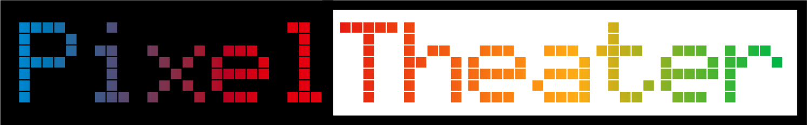

# PixelTheater Animation System



## Overview

PixelTheater is a C++ library designed for creating interactive, 3D LED animations. It provides a platform-independent framework, allowing animations (Scenes) to run on different hardware (like Teensy/FastLED) or simulators (native C++, WebAssembly) with minimal code changes.

**Key Features:**

*   **Platform-Independent Scenes:** Write animation logic once using the `PixelTheater` API; run on multiple platforms.
*   **3D Model Abstraction:** Define complex LED geometry and access LED positions and relationships easily.
*   **Simplified Scene API:** Create modular `PixelTheater::Scene` classes with helpers for LEDs, geometry, time, parameters, and utilities. Using `PixelTheater/SceneKit.h` provides convenient aliases (e.g., `Scene`, `CRGB`, `CHSV`, `PT_PI`).
*   **Color & Palette API:** Platform-independent types (`PixelTheater::CRGB`, `PixelTheater::CHSV`) and functions (`PixelTheater::blend`, `PixelTheater::colorFromPalette`). Methods like `CRGB::nscale8` and `CRGB::fadeToBlackBy` provide direct color manipulation. See [Color System](Color.md) and [Palettes API](Palettes.md).
*   **Parameter System:** Define runtime-configurable parameters for scenes.
*   **Central `Theater` Facade:** Manages platform setup, scene lifecycles, and the main animation loop.

### Architecture

The `Theater` acts as a central coordinator, connecting the chosen hardware `Platform`, the 3D `Model` geometry, and the active animation `Scene`. Scenes interact with the system exclusively through the `PixelTheater::Scene` base class helpers (often via aliases from `SceneKit.h`) and the `PixelTheater` namespace API.

```text
                           ┌───────────┐
                           │ User Code │ // e.g., main.cpp
                           │ (Setup)   │
                           └─────┬─────┘
                                 │ Uses
                                 ▼
                           ┌───────────┐
                           │  Theater  │ (Facade)
                           └─────┬─────┘
 Manages / Provides Access To    │
       ┌─────────────────────────┼──────────────────────────┐
       │                         │                          │
       ▼                         ▼                          ▼
┌──────────────┐      ┌───────────────────┐       ┌────────────────────┐
│   Platform   │      │ IModel/ILedBuffer │       │ Scene N            │
│ (Native/Hdw) │◀─────│    (Interfaces)   │◀──────│ (Your Animation)   │
└──────────────┘      └───────────────────┘       └────────────────────┘
       ▲                         ▲                          ▲
       │ Implemented By          │ Implemented By           │ Inherits From
       │                         │                          │
┌──────┴─────────┐  ┌───────────┴──────────┐      ┌───────┴──────┐
│ NativePlatform │  │ ModelWrapper         │      │ Scene (Base) │
│ FastLEDPlatform│  │ LedBufferWrapper     │      └──────────────┘
└────────────────┘  └──────────────────────┘             │
                                                           │ Provides Helpers
                                                           │ (leds[], model(),
                                                           │  millis(), etc.)
                                                           │ + SceneKit Aliases
```

### Core Concepts

*   **Theater**: The main entry point (`PixelTheater::Theater`). Initializes the platform and model, adds scenes, and runs the animation loop.
*   **Scene**: Base class (`PixelTheater::Scene`) for all animations. Implement `setup()` and `tick()`. Provides platform-independent helpers to access LEDs (`leds[]`), geometry (`model()`), time (`millis()`), parameters (`settings[]`), and utilities (`random8()`). Use `PixelTheater/SceneKit.h` for convenient aliases.
*   **Platform**: Abstraction layer for hardware/environment interaction (e.g., `FastLEDPlatform`, `NativePlatform`). Usually configured once via `Theater`.
*   **Model**: Defines the 3D LED geometry (`IModel` interface, accessed via `Scene::model()`). Generated from configuration files. See [Model System](Model.md).
*   **Parameters/Settings**: Mechanism for runtime configuration of scenes via `param()` and `settings[]`. See [Parameters](Parameters.md).
*   **Color API**: Platform-independent types (`PixelTheater::CRGB`, `PixelTheater::CHSV`) and functions (`PixelTheater::blend`, `PixelTheater::colorFromPalette`). Methods like `CRGB::nscale8` and `CRGB::fadeToBlackBy` provide direct color manipulation. See [Color System](Color.md) and [Palettes API](Palettes.md).

## Getting Started

1.  **Include Header:** Add `#include "PixelTheater/SceneKit.h"` to your scene file. This provides core types and helpers within the `Scenes` namespace.
2.  **Create Scene Class:** Define a class inheriting from the aliased `Scene` type provided by SceneKit.
    ```cpp
    #pragma once
    #include "PixelTheater/SceneKit.h" // Recommended include for scenes

    namespace Scenes { // Optional, but recommended
    class MyScene : public Scene { // Inherit from aliased Scene
    public:
        MyScene() = default;
        ~MyScene() override = default;

        void setup() override;
        void tick() override;
    private:
        // Scene-specific state variables
    };
    } // namespace Scenes
    ```
3.  **Implement `setup()`:** Set metadata (`set_name`, etc.) and define parameters (`param`).
4.  **Implement `tick()`:** Write your animation logic using helpers like `leds[]`, `model()`, `millis()`, `settings[]`, `colorFromPalette`, and other aliases provided by SceneKit.
5.  **Register Scene:** In your main application file (`main.cpp`), include your scene's header and add it to the `Theater` instance after initializing the platform.
    ```cpp
    // --- main.cpp ---
    #include "PixelTheater.h" // Main app setup still uses this
    #include "scenes/my_scene.h" // Include your scene (uses SceneKit internally)

    PixelTheater::Theater theater;

    void setup() {
        // Platform setup (specific to project/hardware)
        // theater.useFastLEDPlatform<...>(...);
        // theater.useNativePlatform<...>(...);

        // Add scenes
        theater.addScene<Scenes::MyScene>();
        // theater.addScene<...>();

        theater.start();
    }

    void loop() {
        theater.update();
    }
    ```

*   For a more detailed guides, see [Creating Animations Guide](../guides/creating_animations.md).

## Key Subsystems Documentation

*   **[Scene API](Scenes.md):** How to structure and write animation scenes.
*   **[Color & Palettes](Color.md):** Using `CRGB`/`CHSV`, predefined palettes, and color utilities.
*   **[Palettes API](Palettes.md):** Specific details on using `CRGBPalette16` and `colorFromPalette`.
*   **[Parameters](Parameters.md):** Defining and using runtime parameters.
*   **[Model System](Model.md):** Accessing 3D geometry (`model()`, `Point`, `Face`).
*   **[Utilities](../guides/creating_animations.md#led-management):** Overview of helpers for time, random numbers, color math (`blend`, `CRGB::nscale8`), etc. available in scenes.
*   **[Build System](build-system.md):** How code and models are compiled.
