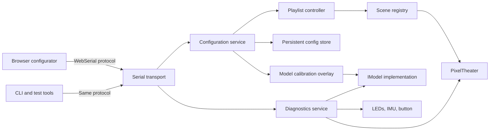

# Firmware Architecture Assessment

## Status

This document assesses the current repository and proposes an architecture for runtime configuration, diagnostics, and automated delivery. It is a design proposal; the runtime configuration and WebSerial features described here are not implemented yet.

The primary product goal is:

1. A user downloads and flashes standard firmware for a supported physical model.
2. The firmware contains a tested set of base animations.
3. A browser connects to the device over WebSerial.
4. The user identifies assembled faces and corrects their positions and rotations.
5. The user chooses the active animations, playback mode, order, duration, and parameters.
6. The device saves the configuration and uses it on later boots without another firmware flash.
7. The same browser can run hardware diagnostics and report structured results.

Developers should still be able to build custom firmware, create animations, and add support for new physical models.

## Executive Assessment

PixelTheater has useful foundations for this direction:

- `IModel` separates animations from the concrete generated model type.
- Scenes are independent classes with typed runtime parameters.
- Platform abstractions support Teensy, native tests, and the web simulator.
- The web simulator already generates controls from scene parameter metadata.
- Model YAML already distinguishes physical face identity, geometric position, and face rotation.

The main issues are at the boundaries between these systems:

- Model assembly configuration is converted into generated C++ and cannot be changed at runtime.
- Scene registration, playback order, hardware integration, and diagnostics are concentrated in `src/main.cpp`.
- Scene parameter definitions, activation, reset behavior, and saved values are not separated cleanly.
- Firmware and the web simulator use different model revisions and scene lists.
- Serial output is diagnostic-only; there is no request/response control protocol.
- Existing tests do not form a reliable CI gate.
- Documentation describes some workflows and APIs that no longer match the implementation.

The repository does not require a complete rewrite. The recommended approach is to preserve the existing rendering and animation core while introducing explicit configuration, registry, transport, storage, and diagnostics layers.

## Current Architecture

### Firmware startup

The current firmware performs most application-level work in `src/main.cpp`:

- configures FastLED and the shared LED buffer
- initializes the IMU and button
- constructs the compile-time model
- validates model data
- registers scenes in a fixed order
- forwards selected IMU values into scene settings
- handles scene switching
- prints status and benchmark information

The model is selected through a template:

```cpp
theater.useFastLEDPlatform<PixelTheater::Models::DodecaRGBv2_1>(leds, NUM_LEDS);
```

The selected generated header contains LED positions, faces, edges, groups, and neighbors. Changing face assignment or rotation therefore requires generating a new header, compiling, and flashing the firmware.

### Scene lifecycle

Scenes are constructed and retained by `Theater`. On a scene switch, the current implementation calls `reset()` and then `setup()` on the selected scene.

Most scenes declare their parameters in `setup()`. Registering a parameter also restores its default value. This means returning to an animation discards live parameter changes unless they are stored elsewhere and reapplied.

This lifecycle combines three separate concerns:

- declaring a scene's interface
- activating or resetting scene state
- setting user configuration

That coupling must be addressed before persistent presets and playlists can behave predictably.

### Web simulator

The web simulator demonstrates that scene metadata and parameters can drive a generated browser UI. This is a useful prototype for the device configurator.

It is not currently a parity test for the firmware:

- firmware uses the v2.1 model with 1,620 LEDs
- the simulator uses the older v2 model with 1,248 LEDs
- scene lists and defaults differ
- the maintained `build_web.sh` path and PlatformIO web build path have diverged

The simulator and device configurator can share UI components and protocol data structures, but they should remain distinct concepts:

- the simulator executes animations in WebAssembly
- the configurator controls real firmware over WebSerial

## Confirmed Correctness and Quality Issues

These should be resolved before building runtime configuration on top of the current behavior.

### Hardware pin conflict

`USER_BUTTON` and `BNO085_INT_PIN` both use GPIO 2. The interrupt is attached even though its flag is not consumed, while the button polls the same pin.

### Model validation mismatch

The current generated model uses logical face IDs 1 through 12. Runtime validation treats `face_id >= FACE_COUNT` as invalid, so points assigned to face 12 can fail validation incorrectly.

Model identity rules should be documented and enforced consistently:

- global LED indices: zero-based
- geometric face slots: preferably zero-based
- logical or physical face identifiers: either zero-based or explicitly one-based, but not mixed

### Boids timer behavior

The Boids scene stores an absolute future timestamp and later treats it as an unsigned countdown. Durations grow with uptime and can underflow.

Scene timing should use one of two explicit representations:

- absolute deadline: compare `now` against a deadline using wrap-safe arithmetic
- remaining duration: decrement a signed or floating-point duration to zero

### Test process exit status

Native and web doctest entry points enable `no-exitcode`. A test command can exit successfully after assertion failures. This must be removed before test jobs are added to CI.

### Python test discovery and expectations

The Python test runner executes unittest and doctest cases but omits pytest-style tests. The generator tests also contain conflicting assumptions about zero-based and one-based face identifiers.

### Web build divergence

The PlatformIO web path delegates to a Makefile that references missing or stale source files. `build_web.sh` follows the current source tree more closely. There should be one authoritative web build invoked locally, by documentation, and by CI.

## Target User Experience

### Standard firmware

Each supported hardware model should have a standard firmware build identified by:

- firmware version
- protocol version
- configuration schema version
- model ID and model revision
- compiled scene catalog version
- hardware feature flags, such as IMU availability

The standard firmware contains executable animation code. Runtime configuration selects and configures those compiled animations; it does not install new native C++ animation code.

This distinction is important on a Teensy. It has no dynamic linker or practical native plugin mechanism. Adding a new C++ animation still requires a new firmware build. Selecting, ordering, and tuning existing animations should not.

### Browser configurator

The user opens a static web application in a WebSerial-capable browser, selects the device, and sees:

- device and firmware information
- model calibration status
- available animations
- current playlist
- generated controls for scene parameters
- playback policy and timing
- diagnostics
- save, restore, import, export, and factory-reset actions

WebSerial currently has stronger support in Chromium-based desktop browsers than in Safari or mobile browsers. A small command-line client using the same protocol should be retained as a fallback and for automated diagnostics.

## Proposed Architecture



### Suggested firmware modules

`src/main.cpp` should become a small composition root. Application behavior should move into modules with explicit responsibilities:

- `FirmwareApp`: startup, service wiring, and top-level update loop
- `DeviceInfo`: firmware, model, protocol, and capability metadata
- `DeviceConfig`: validated in-memory configuration
- `ConfigStore`: atomic persistent load/save and factory defaults
- `SerialProtocol`: framing, command dispatch, validation, and responses
- `ModelCalibration`: face assignment and rotation overlay
- `SceneRegistry`: stable scene identifiers, metadata, and factories
- `PlaylistController`: order, timing, playback policy, and transitions
- `DiagnosticsService`: safe hardware and model tests
- `InputRouter`: button and IMU routing without scene-name comparisons

PixelTheater should remain responsible for model access, scene execution, LED access, colors, timing, and parameter types. Product-specific persistence, playlists, transport, and hardware diagnostics belong in the firmware application layer.

## Runtime Configuration Model

### Configuration document

The browser and device should exchange a versioned JSON document. JSON is appropriate for transport, debugging, import, and export. The device may store the validated data in a more compact representation.

An initial shape could be:

```json
{
  "schemaVersion": 1,
  "modelId": "DodecaRGBv2_1",
  "revision": 7,
  "calibration": {
    "faces": [
      {
        "physicalId": 1,
        "geometricSlot": 0,
        "rotation": 3
      }
    ]
  },
  "playback": {
    "mode": "ordered",
    "repeat": true,
    "entries": [
      {
        "sceneId": "sparkles",
        "durationMs": 30000,
        "parameters": {
          "Speed": 0.4,
          "Glitter": 0.6
        }
      },
      {
        "sceneId": "gravity-marbles",
        "durationMs": 45000,
        "parameters": {
          "population": 20,
          "collisions": true
        }
      }
    ]
  }
}
```

The exact field names should be finalized after the scene parameter and face identity conventions are corrected.

### Stable identifiers

Configuration must not depend on display names such as `"Gravity Marbles"`.

Use stable machine identifiers:

- model: `DodecaRGBv2_1`
- scene: `gravity-marbles`
- parameter: `gravity_strength`
- capability: `imu.orientation`

Display names and descriptions may change without invalidating saved configuration.

### Validation

The device must validate a complete candidate configuration before applying or saving it:

- schema and protocol versions are supported
- model ID matches the firmware
- every geometric slot is assigned exactly once
- rotations are valid for the face type
- scene IDs exist in the compiled registry
- parameter IDs and types match scene schemas
- values satisfy ranges and flags
- playlist length and serialized size are bounded
- duration and transition values are safe

Invalid configuration should leave the active and saved configuration unchanged.

### Transactions and persistence

Slider changes should support live preview without writing persistent storage on every event.

A practical transaction is:

1. `config.begin` creates a candidate revision.
2. Parameter or playlist updates modify the candidate.
3. `config.validate` returns structured warnings and errors.
4. `config.apply` activates it in RAM for preview.
5. `config.save` persists the accepted revision.
6. `config.rollback` restores the last saved revision.

The persistent format should include:

- schema version
- generation or revision number
- payload length
- checksum or CRC
- committed marker

Use two slots or another atomic update scheme so power loss during a save cannot destroy the last valid configuration. If loading fails, use factory defaults and report the reason.

The storage backend should be abstracted. EEPROM emulation, program flash, or another Teensy-supported store can be selected after measuring capacity, write endurance, library support, and firmware size.

## Runtime Model Calibration

### Scope

The first runtime calibration milestone should support assembly variants of one known model, not arbitrary model geometry.

For DodecaRGB, the immutable standard firmware can contain:

- canonical PCB LED coordinates
- dodecahedron geometric slots and adjacency
- face types and LED groups
- hardware channel layout

The saved calibration contains only:

- physical or logical face identity
- geometric slot assignment
- in-plane rotation

This is a small permutation and rotation overlay. It avoids parsing YAML or loading an unrestricted model definition on the microcontroller.

### Calibration workflow

The browser starts a device-side diagnostic pattern:

1. Illuminate one physical face or wiring segment.
2. Ask the user to select its location in the browser's 3D model.
3. Animate an asymmetric marker around that face.
4. Ask the user to rotate the browser control until the marker matches.
5. Repeat until all slots are assigned.
6. Validate that assignments are complete and unique.
7. Preview topology-aware animations.
8. Save the calibration.

The device, not the browser, should generate diagnostic LED patterns. This verifies the real LED buffer, wiring order, and model mapping rather than only visualizing expected data.

### Geometry and neighbors

There are several implementation options:

- apply rigid transforms at boot and recompute point positions
- select from precomputed slot and rotation transforms
- generate a compact complete model blob in the browser or desktop tool

For the first version, precomputed transforms plus a small runtime overlay are preferable. Neighbor and edge data can be remapped if it is defined in geometric-slot space. If rotation changes local LED adjacency, the design must either transform the relevant indices or recompute them at boot.

This should be proven with model-level tests before changing `Model<T>`.

## Scene Registry, Playlists, and Presets

### Scene registry

Manual `theater.addScene<T>()` calls should be replaced or wrapped by a registry containing:

- stable scene ID
- display name and description
- parameter schema
- required capabilities
- factory function
- optional category and version

The registry can still be compiled statically. It provides a discoverable catalog for the browser and removes configuration dependence on registration order.

### Scene lifecycle

The scene contract should distinguish:

- `configure()`: declare metadata and parameter schema once
- `activate()`: initialize transient animation state
- `tick()`: render a frame
- `deactivate()`: release transient resources if needed
- `reset()`: restore runtime state without redefining the schema

Saved parameter values should be applied after schema declaration and before activation. They should not be overwritten when returning to a scene.

### Playlist entries

A playlist entry should reference a scene ID and its own preset. This permits the same scene to appear more than once with different parameters.

Useful playback policies include:

- ordered
- shuffle
- random
- single scene

Each entry may define:

- duration
- scene parameters
- transition type and duration, once transitions exist
- optional conditions or input mode in a later schema

The first implementation should keep modes small and deterministic. Scheduling based on complex rules can be added after ordered playlists and presets are reliable.

### External animation repositories

Separating PixelTheater and animation packages into independent repositories can improve maintenance and reuse. PlatformIO can assemble those dependencies at build time.

This does not provide runtime installation of native scenes. Standard firmware releases should publish a documented scene catalog. Advanced users can build custom firmware with additional packages.

## WebSerial Protocol

### Protocol properties

The protocol should be:

- versioned
- request/response based
- stream-framed
- bounded in message and collection size
- explicit about errors
- usable from both JavaScript and Python
- independent from human-readable firmware logs

Newline-delimited JSON is suitable for an initial implementation if log output is moved to separate structured events or disabled during protocol sessions. A length-prefixed frame may be safer if messages become large.

Every request should carry an ID:

```json
{"id": 12, "method": "device.getInfo", "params": {}}
```

The response should preserve it:

```json
{
  "id": 12,
  "result": {
    "firmwareVersion": "0.4.0",
    "protocolVersion": 1,
    "modelId": "DodecaRGBv2_1"
  }
}
```

Errors should be structured:

```json
{
  "id": 12,
  "error": {
    "code": "CONFIG_MODEL_MISMATCH",
    "message": "Configuration targets a different model"
  }
}
```

### Initial command groups

- `device.getInfo`
- `device.getCapabilities`
- `scene.list`
- `scene.getSchema`
- `scene.preview`
- `playlist.get`
- `playlist.setCandidate`
- `config.get`
- `config.validate`
- `config.apply`
- `config.save`
- `config.rollback`
- `config.export`
- `config.factoryReset`
- `diagnostics.list`
- `diagnostics.start`
- `diagnostics.status`
- `diagnostics.stop`

Large responses should be bounded or chunked. Firmware must reject unknown fields where ambiguity would be unsafe and ignore them only where forward compatibility is explicitly defined.

### Safety

WebSerial requires a user gesture and browser permission, but firmware must still treat all input as untrusted:

- limit message length and nesting
- validate numeric conversion and ranges
- avoid arbitrary memory allocation from requested sizes
- rate-limit persistent writes
- reject commands that conflict with active diagnostics
- cap LED brightness and estimated current
- provide a reliable command to stop tests and clear LEDs

The protocol should configure data and invoke known diagnostics. It should not support arbitrary native code upload.

## Diagnostics Mode

Diagnostics should run as an explicit firmware service rather than as ordinary playlist scenes. It needs exclusive control of LEDs and selected hardware inputs while active.

### Model and LED diagnostics

- illuminate each physical wiring segment
- identify geometric face assignments
- show orientation markers for each face
- walk LEDs in global wiring order
- walk each output channel independently
- display RGB and color-order test patterns
- render face edges, centers, groups, and neighbors
- test geometric axes and coordinate orientation
- run model validation and return structured failures

### Hardware diagnostics

- report button state and transitions
- stream IMU availability, orientation, gravity, and acceleration
- verify IMU update rate and detect stale data
- report firmware loop and LED refresh timing
- report estimated memory use where supported
- expose reset reason and saved-config load status

### Power safety

Diagnostics must avoid unsafe full-current patterns:

- use a conservative default brightness
- limit the number of simultaneously lit LEDs
- require explicit confirmation for high-load tests
- time-limit tests
- clear LEDs when the browser disconnects or a test times out

### Diagnostic results

Results should use stable machine-readable codes so the browser, CLI, CI hardware runner, and support documentation can interpret the same output.

Example:

```json
{
  "test": "model.validation",
  "status": "failed",
  "checks": [
    {
      "code": "MODEL_FACE_ID_OUT_OF_RANGE",
      "severity": "error",
      "faceId": 12,
      "pointId": 1485
    }
  ]
}
```

The browser can provide plain-language guidance, while the raw result remains exportable for support.

## CI/CD Design

### Pull request pipeline

The pull request pipeline should contain independent jobs so failures are easy to diagnose.

#### Documentation

- build the documentation site
- fail on missing TOC entries and broken internal links
- verify documented commands and model paths where practical

#### Python tooling

- use one test discovery framework
- run all generator and geometry tests
- lint or format-check maintained Python sources
- regenerate committed model artifacts and fail on a diff
- verify model YAML against an explicit schema

#### Native C++

- run native PixelTheater tests with real failure exit codes
- run deterministic scene smoke tests
- test configuration parsing, migration, validation, and rollback
- test the serial protocol with malformed and oversized input

#### Firmware

- compile each supported standard model
- compile with and without optional hardware capabilities where supported
- report flash and RAM usage
- fail when configured budgets are exceeded
- verify generated firmware metadata and scene manifests

#### Web

- use one authoritative WebAssembly build
- run browser smoke tests against the simulator
- test the configurator with a mocked serial transport
- verify scene schemas generate usable controls
- verify protocol compatibility fixtures

### Geometry test quality

Generated text checks are not sufficient. Model tests should verify:

- known LED coordinates
- face normals and planarity
- expected face and LED counts
- unique face assignment
- reciprocal edge connectivity
- expected neighbor IDs and distances
- group bounds
- remapping and rotation invariants
- generated output determinism

Add golden fixtures for each supported shape and model revision.

### Hardware-in-the-loop

Hardware tests should be a separate manual or scheduled workflow on a controlled runner:

- flash a known firmware artifact
- establish serial communication
- request device information
- run safe diagnostics
- verify button and IMU events where the fixture supports them
- capture timing and model-validation results
- restore factory configuration

This workflow should not block every pull request until the test fixture is reliable. It can initially gate releases or run nightly.

### Release pipeline

A versioned release should produce:

- model-specific firmware images
- checksums
- firmware and protocol metadata
- compiled scene catalog
- hosted browser configurator
- web simulator assets
- configuration schema
- release notes and known compatibility constraints

Suggested release flow:

1. Pull request CI proves tests and builds.
2. A version tag triggers reproducible release builds.
3. Artifacts are attached to a GitHub release.
4. The static configurator is deployed.
5. The configurator verifies protocol and model compatibility before writing.

Standard firmware binaries should be named by model and hardware revision so a non-technical user does not need to choose build flags.

## Migration Plan

### Phase 0: establish a trustworthy baseline

- resolve the GPIO conflict
- fix model face-ID validation
- fix Boids timers
- remove doctest `no-exitcode`
- repair Python test discovery and face-ID expectations
- select one web build path
- add initial CI for native tests, Python tests, firmware compilation, and web compilation

### Phase 1: separate application services

- reduce `src/main.cpp` to startup and service composition
- introduce stable device, model, scene, and parameter identifiers
- add `SceneRegistry`
- separate scene schema declaration from activation
- replace scene-name IMU routing with capability-based input

### Phase 2: protocol and persistent configuration

- implement the serial framing and device-info handshake
- implement `DeviceConfig` validation
- implement transactional in-memory preview
- implement atomic persistent storage and factory fallback
- add a Python protocol client for tests and recovery

### Phase 3: runtime playlists and parameters

- expose compiled scene catalog and schemas
- persist ordered playlists and per-entry presets
- add ordered, shuffle, random, and single-scene policies
- restore values without re-registering or resetting parameter definitions

### Phase 4: model calibration

- implement runtime face permutation and rotation
- build face-identification and orientation diagnostics
- create the browser calibration workflow
- verify topology-aware animations after remapping

### Phase 5: diagnostics and release automation

- implement structured diagnostic tests
- add browser diagnostics UI
- add optional hardware-in-the-loop tests
- publish model-specific firmware and configurator releases

### Phase 6: multi-shape tooling and external packages

- replace dodecahedron-specific generator transforms with shape backends
- add cube, then icosahedron, then mixed-face icosidodecahedron fixtures
- publish PixelTheater and selected scenes as reusable packages

## Acceptance Criteria

The first complete runtime-configuration release should meet these criteria:

- A user can flash one standard firmware image for the stated model revision.
- The browser identifies firmware, protocol, model, and scene compatibility.
- A complete face assignment and rotation can be performed without recompiling.
- Invalid or interrupted saves cannot remove the last valid configuration.
- A user can enable, disable, order, and repeat compiled animations.
- A user can save per-playlist-entry parameter presets.
- Saved configuration survives power cycles.
- Factory reset restores a usable default playlist and model mapping.
- Diagnostics can identify faces, orientation, LED order, button state, and IMU status.
- Diagnostics enforce conservative power limits and stop safely on timeout.
- CI runs Python tests, native C++ tests, firmware builds, and the web build with meaningful exit codes.
- Release automation publishes model-specific firmware with compatibility metadata.

## Decisions Still Required

Before implementation, the project should explicitly decide:

- whether physical face IDs are zero-based or one-based across all layers
- which Teensy storage backend is appropriate after measuring size and endurance
- whether model calibration recomputes geometry or selects precomputed transforms
- whether playlist parameters are stored per scene or per playlist entry
- which playback policies and transitions belong in schema version 1
- whether configuration transport starts with newline-delimited JSON or length-prefixed frames
- which standard scene catalog ships with each model
- whether the configurator and simulator remain one application or share components as separate applications
- which Chromium browsers and operating systems are supported for the first WebSerial release

These decisions should be recorded before the protocol and persisted configuration formats become public compatibility contracts.
