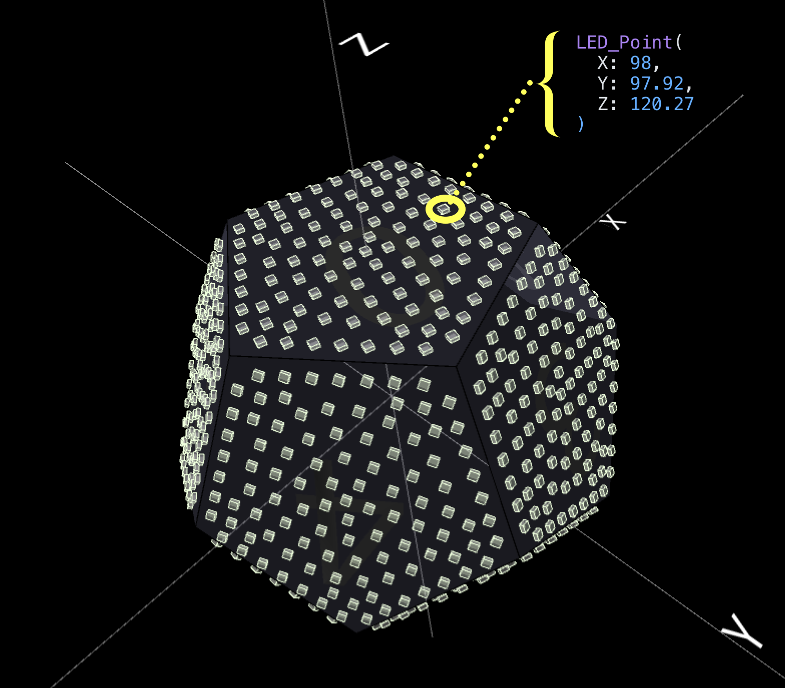

# Creating Animations

This short guide was made to help you create your own animations for the DodecaRGB. 

The project is built in C++ and uses the Arduino framework, FastLED, and several other libraries. In general, common patterns around the stdlib are use, such as std::string, std::vector, std::map, std::unique_ptr, etc. In addition the Eigen library is used for linear algebra. PlatformIO or Cursor IDE are assumed for development.

The DodecaRGB firmware can load multiple animations and switch between them. Each animation is like a small shader program - it runs every frame and updates the LED colors based where it is on the display. This happens 50+ times per second, and the addressable LEDs are updated in parallel. The animation framework provides common functionality and patterns for defining animations, handling settings, presets, playlists, color palettes, status messages, and more.

## Getting Started

Read the overview of the [PixelTheater animation system](PixelTheater/README.md).

## Color Palettes

Three default palettes are available:

- `basePalette`: Rich, saturated colors
- `highlightPalette`: Bright, light colors
- `uniquePalette`: Distinct, high-contrast colors

Helper functions for color management:

```cpp
String colorName = getClosestColorName(CRGB(255, 0, 0));  // Returns "Red"
String ansiColor = getAnsiColorString(CRGB::Red);         // Terminal color
float brightness = get_perceived_brightness(color);
```


### Playback Modes

- `HOLD`: Stays on current animation until manually changed (default)
- `ADVANCE`: Automatically advances through playlist in order
- `RANDOM`: Randomly selects next animation from playlist

## Best Practices

### LED Management

- Access LEDs directly through `leds[]` array
- Framework handles `FastLED.show()` calls
- Use `fadeToBlackBy()` or `nscale8()` to manage brightness
- `nblend()` for safe color mixing

### Animation Flow

- Track time with counters or `millis()`
- Make speed adjustable via parameters
- No `delay()` calls in `tick()`
- Pre-calculate values in `init()`

### Hardware Model Constants

- `numLeds()`: Total LEDs
- `leds_per_side`: LEDs per face
- `num_sides`: Number of faces (12)

## Animation Strategies

### Time and Motion

TODO

### Palette-Based Colors

TODO

### Random Effects

The animation framework automatically seeds both the system random number generator and FastLED's random functions during setup() using hardware entropy from the microcontroller, so you don't need to call random.seed() or random16_set_seed() in your animations.

```cpp
void sparkleEffect() {
    // Add random sparkles to each face
    for(int face = 0; face < num_sides; face++) {
        if(random8() < 40) {  // 40/255 chance per face
            int led = (face * leds_per_side) + random8(leds_per_side);
            leds[led] = CRGB::White;
        }
    }
    // Fade all LEDs each frame
    fadeToBlackBy(leds, numLeds(), 64);
}
```

## Coordinate Systems

The DodecaRGB provides several ways to address LEDs spatially:

### Linear Addressing

The LEDs of each PCB are laid out roughly in a spiral pattern, starting in the center and radiating outwards. Each side connects to the next, so all 12 sides are connected to each other in a single array.

Basic sequential access:

```cpp
for(int i = 0; i < numLeds(); i++) {
    leds[i] = CHSV(i * 256/numLeds(), 255, 255);  // Hue varies smoothly across LEDs
}
```


### Face-Based Rendering

```cpp
void renderByFace() {
    for(int face = 0; face < num_sides; face++) {
        // Calculate LED range for this face
        int start = face * leds_per_side;
        int end = start + leds_per_side;
        
        // Example: alternate faces between two colors
        CRGB faceColor = (face % 2 == 0) ? CRGB::Red : CRGB::Blue;
        fill_solid(leds[start], leds_per_side, faceColor);
    }
}
```

### 3D Coordinates

Each LED has a mapped position using the `points[]` array. All of the 3D positions of each LED of the DodecaRGB model have been pre-calculated and are available to animation code.

Some examples showing use in a scene:

```cpp
        // Access a specific LED point (e.g. LED #42)
    LED_Point& led = points[42];
    
    // Access coordinates
    float x = led.x;
    float y = led.y;
    float z = led.z;
    
    // Get which side it's on (0-11)
    int side = led.side;
    
    // Get its label number within that side (they are labelled)
    int label = led.label_num;
    
    // Access neighbors (stored as distance_map structs)
    for (const auto& neighbor : led.neighbors_map) {
        // Each neighbor has an LED number, distance, and direction vector
        int neighbor_led = neighbor.led_number;
        float distance = neighbor.distance;
        Vector3d direction = neighbor.direction;
        
        // Can look up neighbor's coordinates
        LED_Point& neighbor_point = points[neighbor_led];
    }
    
    // Calculate distance to another point
    float dist = led.distance_to(&points[100]);
    
    // Or distance to arbitrary XYZ coordinate
    float dist2 = led.distance_to(1.0f, 0.0f, 0.0f);
```



### Spherical Coordinates

With the x,y,z coordinates in place we can use spherical coordidnates to animate objecgts in a spherical space. This is useful for orbital effects (as seen in Blob animation):

```cpp
// Convert angle and elevation to position
float azimuth = counter * 0.01;          // Horizontal angle
float elevation = PI/2;                  // Vertical angle (0=top, PI=bottom)
float radius = sphere_radius;            // Distance from center

// Convert to cartesian
float x = radius * sin(elevation) * cos(azimuth);
float y = radius * sin(elevation) * sin(azimuth);
float z = radius * cos(elevation);

// Light LEDs near this position
for(int i = 0; i < numLeds(); i++) {
    if(points[i].distance_to(x, y, z) < radius) {
        leds[i] = CRGB::Blue;
    }
}
```

It helps to imagine a sphere inscribed in the DodecaRGB, with the center of the sphere at the center of the DodecaRGB. The `points[]` array contains the 3D coordinates of each LED in this sphere.


See the `Blob` animation for an example of orbital movement using spherical coordinates, and `XYZScanner` for cartesian coordinate scanning effects.

## Scene Lifecycle

Each animation goes through the following initialization sequence:

... TODO