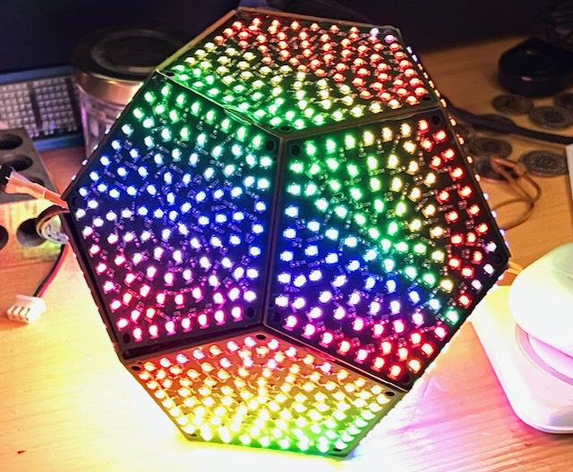

## Vision

To create an awesome open-source animation and interaction platform for running resolution-indpendent apps on portable, interactive 3D physical models. And because we love making things that have lots of LEDs.

## Sections

### PixelTheater API Reference

- [Library Overview](PixelTheater/README.html) - Architecture and core concepts
- [Scene System](PixelTheater/Scenes.html) - Scene API reference
- [Model System](PixelTheater/Model.html) - 3D geometry and face access
- [Parameters](PixelTheater/Parameters.html) - User parameter system
- [Color System](PixelTheater/Color.html) - Color manipulation and utilities
- [Palette System](PixelTheater/Palettes.html) - Color palette API
- [Build System](PixelTheater/build-system.html) - Compilation and dependencies

### Main Documentation

- [DodecaRGB and PixelTheater Documentation](README.html)

### Guides

- [Creating Animations](guides/creating_animations.html) - Comprehensive tutorial from basics to advanced techniques
- [Development Setup](guides/development.html) - Environment setup and tooling
- [Project Guidelines](guides/coding_guidelines.html) - Code standards and best practices
- [Web Simulator Guide](guides/web-simulator.html) - Browser-based testing environment
- [DodecaRGB V1 info](guides/Dodeca-V1-info.html) - Legacy hardware documentation

## Web Simulator

The [Web Simulator](simulator/index.html) provides a browser-based testing environment for your animations.

## Features

- 1,248 individually addressable RGB LEDs
- Web-based simulator for development
- Flexible parameter system
- Multiple coordinate systems
- Real-time control capabilities
