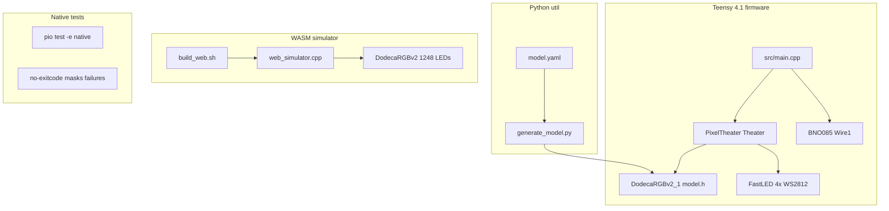
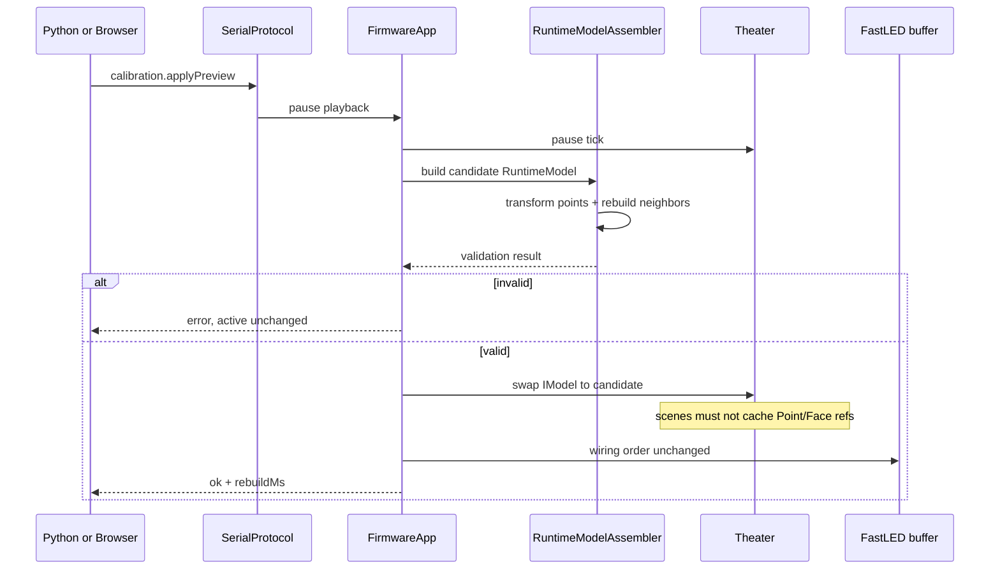

# Runtime Config Plan Review

Review of [`.cursor/plans/runtime_config_architecture_15cf71aa.plan.md`](../../.cursor/plans/runtime_config_architecture_15cf71aa.plan.md) against the firmware repo, `~/src/dodeca-v2-hardware`, git history, and integration sketches.

Status: findings for plan amendment. Does not implement the architecture.

## Verdict

The plan’s direction is sound: keep PixelTheater as the render core, put product concerns in a firmware application layer, prove runtime geometry before UI, and put first-time assembly before playlist tuning.

Several assumptions need correction before Phase 1/2. The highest-risk gaps are **undocumented wiring↔channel mapping**, **geometry unit drift (official 46 mm vs YAML 60 mm)**, **Theater’s inability to accept an external `IModel` today**, **assessment vs plan disagreement on neighbor rebuild**, and **Serial NDJSON sharing a port with `printf` logs**.

---

## Stack (as it exists)



| Layer | Role today | Plan impact |
|-------|------------|-------------|
| Teensy firmware | Composition root in `main.cpp`; fixed model + scene list | Needs `FirmwareApp`, protocol, store, assembler |
| PixelTheater | `Theater` always builds `Model<TModelDef>`; scenes use `IModel` | Must add inject/replace `IModel` API |
| Native tests | Strong library coverage; exit codes broken | Phase 0 CI prerequisite |
| Python `util/` | YAML + PnP → generated `model.h` | Source of `FaceTypeAsset` / `ShapeAsset` |
| WASM web | Simulator + schema-driven param UI; no WebSerial | Prototype for Phase 5 UI, not onboarding transport |

---

## Hardware context (`dodeca-v2-hardware`)

`~/src/dodeca-v2-hardware` is the **v2.2 control board** repo (power, Teensy, four LED outputs). It is **not** the face-PCB or mechanical assembly source of truth.

### Present there

- 12 × 135 WS2812 → **1,620** LEDs; **4 channels × 3 faces × 135 = 405** LEDs/channel
- JST outputs J1–J4: 5V / GND / DATA (docs disagree on 3-pin vs 4-pin wording)
- Pin map (`v2.2/teensy-notes.md`): LED data **19, 18, 14, 15**; user button **GPIO 2** (also BQ25895 `QON`); BQ25895 on Wire1; status pins 4/7/8/9
- Power: dual 18650, TPS2121 mux, BQ25895 boost to 5V rail; VIN ≤ ~5.5 V for LED safety

### Absent from both repos (blocking for calibration UX)

- **Which three faces sit on J1 vs J2 vs J3 vs J4**
- Silkscreen **board label** definition and how it relates to YAML `faces[].id`
- Face-board gerbers / v2.1 PnP CSV (YAML references `pcb/PickAndPlace_PCB_DodecaRGB_v2_1_2025-06-14.csv`; file missing under `src/models/DodecaRGBv2_1/`)

### Firmware vs control board mismatches to fold into Phase 0

| Topic | Hardware repo | Firmware today |
|-------|---------------|----------------|
| Pin 2 | Button + BQ25895 QON | Button + unused BNO085 INT |
| BQ25895 | Required for power path | Not integrated |
| IMU | Optional on I2C header | BNO085 assumed |
| Channel→face map | 3 faces/JST, IDs unspecified | Serial order only in `model.yaml` |

**Plan change:** treat control-board docs as the GPIO/power authority; keep geometry/calibration authority in firmware. Add an explicit `HardwareProfile.channels[]` with `WiringIndex` ranges per JST. Document that **ChannelIndex ≠ WiringIndex ≠ SlotIndex ≠ BoardLabel**.

---

## UI assumptions — validated

| Plan claim | Result | Notes |
|------------|--------|-------|
| Web UI consumes param schemas/JSON | Confirmed | `get_scene_parameters_json` → `simulator-ui.js` |
| Scene switch `reset()` then `setup()` overwrites params | Confirmed | Simulator keeps a JS-side bag; firmware does not |
| No Serial input / no NVM | Confirmed | |
| `unordered_map` param order; select `"TODO"` | Confirmed | |
| Phase 4 WebSerial separate from WASM | Confirmed as gap | No `navigator.serial` in `web/` |
| 3D view reusable for slot picking | Partial | Mesh + camera only; no pick/assign UX |
| IdentifySides / TestScene commented out | Firmware yes; web enables TestScene | IdentifySides not in web list |

Current web product is a **WASM simulator**, not a device configurator. Parameter-control builder can be extracted for playlist tuning later; it is not a transport or calibration wizard.

Calibration UX today: edit `model.yaml` → regenerate → flash; optional IdentifySides scene.

---

## Git history themes

| Period | Theme | Relation to plan |
|--------|-------|------------------|
| Early 2025 | Param system, Theater, web simulator | Foundations for schema-driven UI |
| Mid 2025 | Model v2.1, edges/groups, remap, 1-based face IDs, IdentifySides | Build-time calibration path; plan’s runtime overlay is greenfield |
| Apr 2026 | Docs audit | Assessment doc is new proposal, not continuation of an implementation branch |
| Stale branches | `settings-refactor`, `better-config` | Historical presets ambition; different library shape — do not revive blindly |

Runtime config, WebSerial, persistence, and test CI are **not half-landed** on `main`.

---

## Integration sketches (assumption checks)

### 1. Identity domains vs current YAML

Today one `faces:` row conflates three facts:

```text
faces list order  →  WiringIndex (serial LED range)
faces[].id        →  BoardLabel (1..12 on v2.1)
faces[].remap_to  →  SlotIndex override (optional)
faces[].rotation  →  RotationStep
```

Proposed record (good), but onboarding protocol must also expose **channel**:

```cpp
struct FaceAssignment {
    BoardLabel boardLabel;     // 1..N displayed
    WiringIndex wiringIndex;   // 0..N-1 LED-buffer segment
    SlotIndex slotIndex;       // 0..N-1 geometric slot
    RotationStep rotationStep; // 0..orientationCount-1
};

struct ChannelSegment {
    ChannelIndex channel;      // 0..3 → J1..J4
    WiringIndex firstWiring;
    uint16_t faceCount;        // 3 for current kit
};
```

Assessment JSON example used `physicalId` / `geometricSlot` and omitted `wiringIndex`. Align transport names with the plan’s domains before Phase 3.

### 2. NDJSON protocol sketch (Phase 3 minimum)

Quiet session: firmware suppresses or redirects `printf` status lines; only framed messages on the wire.

```json
{"id":1,"method":"device.getInfo","params":{}}
{"id":1,"result":{"firmwareVersion":"0.3.0","protocolVersion":1,"modelId":"DodecaRGBv2_1","onboardingRequired":true,"eepromFree":1800}}

{"id":2,"method":"calibration.setCandidate","params":{
  "assignments":[{"wiringIndex":0,"boardLabel":7,"slotIndex":3,"rotationStep":2}]
}}
{"id":2,"result":{"ok":true,"complete":false,"unassignedSlots":[0,1,2,4,5,6,7,8,9,10,11]}}

{"id":3,"method":"calibration.applyPreview","params":{}}
{"id":3,"result":{"ok":true,"rebuildMs":183,"validation":{"errors":[]}}}

{"id":4,"method":"diagnostics.start","params":{"pattern":"wiring.segment","wiringIndex":0}}
```

**Risk:** baud 115200 + interleaved log lines will break JSON parsers. Phase 3 must gate logging behind a protocol session or a second UART.

### 3. Preview / swap sequence



**Missing Theater API today:** `useFastLEDPlatform<TModelDef>()` always constructs `Model<T>`. Phase 2 needs something like:

```cpp
theater.useFastLEDPlatform(leds, NUM_LEDS); // platform only
theater.setModel(std::move(runtimeModel));  // inject IModel
theater.replaceModel(std::move(candidate)); // pause-safe swap
```

Scenes currently re-query `model()` each tick (no long-lived `Point*` caches found under `src/scenes/`), which is favorable — still make the contract explicit.

### 4. EEPROM budget sketch

Teensy 4.1 emulated EEPROM is **4,284** bytes. Dual 2,048-byte records fit.

```text
Record (≤2048):
  magic, schema, profileId, generation, length, crc32, committed
  assembly: 12 × FaceAssignment (~48–96 B)
  device: brightness, timeouts, flags (~32 B)
  playback: N entries × (sceneId hash + duration + sparse param overrides)
```

Assembly alone is tiny. Playlist + param overrides are the squeeze. Plan correctly rejects oversized candidates at validate time.

**Risk:** do not store JSON in EEPROM; plan already says binary — keep that.

### 5. Geometry units (unsupported claim)

Official physical edge length is **46 mm** (also in `util/models/config.py`). Firmware YAML still says `edge_length_mm: 60.0` / `radius_mm: 130.0`; generator still uses hard-coded `radius = 200`, `scale = 5.15` in `util/dodeca_core.py`.

**Plan change:** make 46 mm the source of truth. Phase 0 unit reconciliation is: official 46 mm ↔ YAML ↔ `dodeca_core` constants ↔ generated world coordinates ↔ `SPHERE_RADIUS`.

### 6. Neighbor rebuild vs assessment

| Source | Preference |
|--------|------------|
| Assessment doc | Precomputed transforms + remap neighbors in slot space |
| Plan | Full pairwise rebuild (~2.6e6 distance checks), 250 ms budget |

Both can work. Full rebuild is simpler to prove against golden fixtures but may make **per-rotation live preview** feel sluggish. Suggested split:

1. Phase 1: full rebuild for equivalence proof and boot.
2. Preview path: transform points + faces first; defer neighbor rebuild until save/apply if identify patterns do not need neighbors.
3. Keep spatial index as fallback only if measured Teensy time exceeds budget.

### 7. RAM double-buffer

Rough `Point` size ≈ 2 + 1 + 12 + 7×(2+4) ≈ **55–80 B** → ~90–130 KB per point table; dual buffer ~180–260 KB of Teensy’s 1 MB. Feasible, but Phase 1 should measure with faces/edges/groups included and avoid three live copies.

### 8. `ModelWrapper::face()` one-based assumption

```cpp
uint8_t array_index = logical_face_id - 1;  // model_wrapper.h
```

This matches v2.1 IDs 1–12 and breaks zero-based fixtures / DodecaRGBv2. Identity contract work in Phase 0 is not documentation-only — it is a runtime bug domain. Also `Limits::MAX_LEDS_PER_FACE = 128` while v2.1 has **135**.

---

## Finding groups

### A. Confirmed — keep in plan

- GPIO 2 conflict (extend: also BQ25895 QON on control board)
- Face ID 12 validation failure
- Both Boids timer bugs; blocking button `while`
- doctest `no-exitcode`; docs-only CI
- Firmware v2.1 / 1620 / 10 scenes vs simulator v2 / 1248 / different scenes
- Stale `web/Makefile`; working `build_web.sh`
- No Serial protocol / NVM
- Scene lifecycle couples schema + defaults
- Identity domains must split BoardLabel / WiringIndex / SlotIndex
- Calibration before playlist is the right product order
- Dual-record atomic store; binary EEPROM payload
- Do not split PixelTheater into external packages yet

### B. Correct or add

1. **Set official edge length to 46 mm**; fix YAML 60 mm and generator constants to match.
2. **Add ChannelIndex / J1–J4 mapping** to `HardwareProfile`; document as currently unknown and needing a physical audit.
3. **Theater model injection API** as an explicit Phase 2 deliverable (not implied).
4. **Serial session mode** (mute logs or second UART) as Phase 3 acceptance.
5. **Align assessment JSON** with WiringIndex + BoardLabel naming.
6. **Preview may skip neighbor rebuild**; full rebuild on save/boot.
7. **Raise / parameterize `MAX_LEDS_PER_FACE`** (≥135) in Phase 0.
8. **Restore or relocate v2.1 PnP CSV**; FaceTypeAsset generation depends on it.
9. **Link or vendor control-board pin/power notes** into firmware docs (hardware context gap).
10. **Fix phase diagram numbering** in the plan (mermaid Phase 2/3 vs todo Phase 2–5).
11. **Pin 2 resolution** must consider button + IMU INT + BQ25895 QON together.
12. **BQ25895 / power diagnostics** belong in Phase 6 (or late Phase 3 diagnostics), not ignored — hardware already has the driver tree elsewhere.

### C. Risks / open questions

- Can silkscreen labels be assumed 1–12 matching YAML ids, or are kits unlabeled?
- Is factory geometry the current YAML map, or a canonical “identity” map with all rotations 0?
- WebSerial mobile/Safari unsupported — Python client as required fallback is correct; state that in Phase 4 acceptance.
- Mixed-face / cube / icosahedron in Phase 6 is fine only if Phase 1 fixtures already exercise non-dodeca shapes.
- Assessment preferred remapped neighbors; plan prefers rebuild — pick one primary path to avoid two incomplete implementations.
- Anchor convention: is “Side 1 up” always the same canonical top `SlotIndex`, and does locking Side 1 also freeze its `rotationStep` for the whole walk?

### D. Out of scope (plan correctly defers)

- Native scene plugins / dynamic code load
- YAML parse on Teensy
- WASM inside configurator
- Universal single firmware for all shapes
- Playlist UI before Python onboarding proof

---

## Interactive calibration UX (updated from IdentifySides + product intent)

Miswiring and rotation are the **normal** kit state. The offline loop (edit YAML → regenerate → flash → stare at IdentifySides) works for experts but is slow: rotation direction is easy to invert, and swapping sides needs mental math. Runtime config exists to replace that with a **see → adjust → preview → correct → next** loop on the physical object.

### What IdentifySides already proved

From [`src/scenes/identify_sides/README.md`](../src/scenes/identify_sides/README.md):

| Signal | Encoding | Why |
|--------|----------|-----|
| Center cluster | `N` lit LEDs = side number (`geometric_position + 1` today) | Count pixels → BoardLabel `1..12` |
| Edge cluster | `N` LEDs in neighbor color = neighbor’s side number | Seam shows “who should be next door” |
| One-based labels | Side 1 = 1 pixel, not “face 0” | Matches how people count on hardware |

Full simultaneous map of all faces/edges is valuable as an expert **full-map** mode. First-time setup should use a quieter **focus** mode built from the same primitives.

### Primary procedure: anchor-and-walk

1. Physically put **Side 1** facing up. That board is the fixed reference for the session.
2. Lock BoardLabel `1` to the top slot (and its rotation once correct).
3. Focus the next unresolved face that shares an edge with the resolved set.
4. Light only that face plus the **shared-edge pair** (resolved side shows expected focus identity; focus side shows resolved identity).
5. User either **rotates** (`A`/`D`) or **moves the side up/down the wiring list** (`W`/`S`) until the seam markers match. `W`/`S` swaps the focused entry with the next/prev PCB in addressable order (not “pick a random board label”). After `W` twice from side 2, the second chain segment is remapped to side 4’s expected geometry; addressing and 3D placement both update on preview.
6. Confirm → advance. Save when complete.

Wiring-segment illuminate (“which PCB is this strip?”) remains a secondary harness diagnostic, not the primary wizard.

### Python vs WebSerial (same loop)

Both clients drive the same diagnostics + candidate/preview commands. Python uses WASD in the terminal; Chrome uses the same keys plus on-screen controls and a simple resolved/focus diagram. Device LEDs are authoritative. Preview must keep up with key-repeat (~100–250 ms), so interactive steps skip full neighbor rebuild.

---

## Proposed plan amendments (summary)

1. **Phase 0:** hardware-context doc; `MAX_LEDS_PER_FACE`; official **46 mm**; pin-map triad; restore PnP.
2. **Phase 1:** assembler vs golden v2.1; non-dodeca fixtures; measure rebuild; transform-only preview path.
3. **Phase 2:** `Theater::setModel` / `replaceModel`; channels; candidate/active/saved; DiagnosticsService from IdentifySides primitives.
4. **Phase 3:** quiet NDJSON; EEPROM; Python **WASD anchor-and-walk** client; `diagnostics.setFocus` / `edge.pair`.
5. **Phase 4:** WebSerial same walk UX; CW/CCW-from-outside convention; full-map optional; wiring-segment advanced.
6. **Phase 5–6:** playlist/params; more models; power/BQ diagnostics.

Immediate next step unchanged: Phase 0 + narrow Phase 1 geometry spike.

---

## Suggested docs follow-ups

- Keep this review beside [`architecture-assessment.md`](architecture-assessment.md); assessment remains the broader proposal, this file is the plan validation pass.
- Add a short “Hardware” section or link under Main Documentation pointing at control-board pin/power facts and the unresolved JST↔face map.
- Update `.cursorrules` / Model.md LED counts when Phase 0 lands (still describe 1,248 in places).
- When Phase 2/3 land, fold the anchor-and-walk procedure into IdentifySides README or a dedicated calibration guide.
