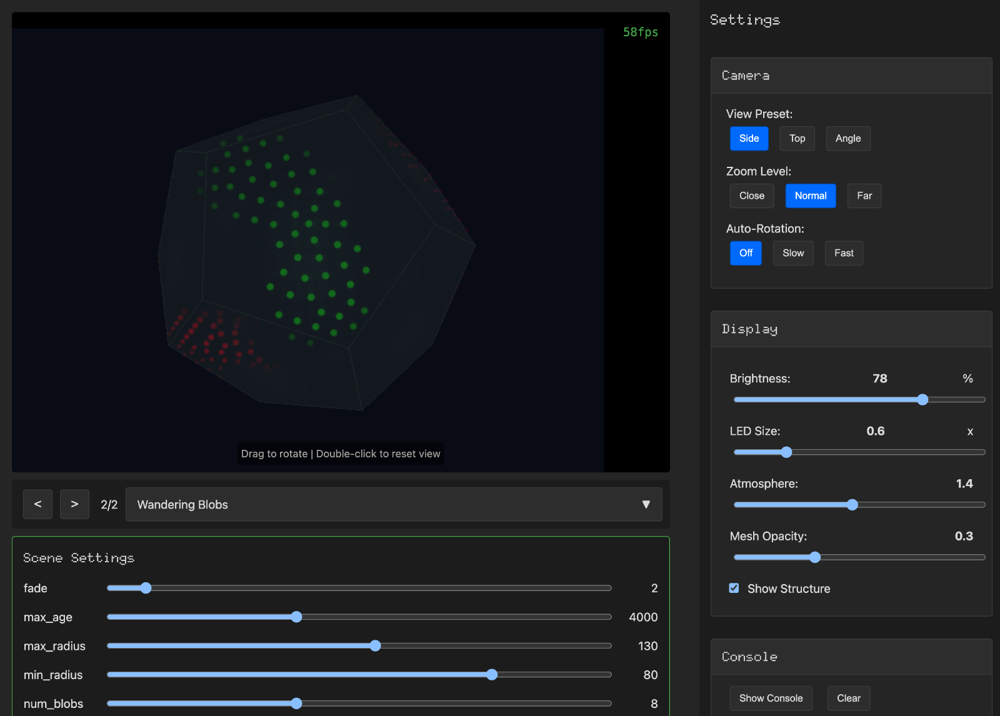

# Web Simulator Guide

The DodecaRGB Web Simulator provides a browser-based visualization and testing environment for LED animations. It uses WebGL for 3D rendering and Emscripten to compile the C++ codebase to WebAssembly.



## Prerequisites

- Emscripten SDK (version 3.1.0 or higher)
  - macOS: `brew install emscripten`
  - Other platforms: Follow [Emscripten installation guide](https://emscripten.org/docs/getting_started/downloads.html)
- Make build system
  - macOS: Install Xcode command line tools with `xcode-select --install`
  - Linux: Install with your package manager (e.g., `apt install make`)
  - Windows: Install MinGW or use WSL

## Building the Simulator

1. Build using PlatformIO:
   ```bash
   pio run -e web
   ```
   This will:
   - Compile the C++ code to WebAssembly using Emscripten
   - Generate the web application in the `web` directory
   - Create necessary JavaScript bindings

2. Start the development server:
   ```bash
   pio run -t serve
   ```
   This will start a local web server, typically at `http://localhost:8000`

## Configuration and Settings

The web simulator supports various runtime settings that can be adjusted through the UI:

### Visual Settings
- **Brightness**: Adjust LED brightness (0-255)
- **LED Size**: Control the size of LED points in the visualization
- **Mesh Visibility**: Toggle the dodecahedron mesh visibility
- **Mesh Opacity**: Adjust the transparency of the mesh
- **Atmosphere**: Control the intensity of the atmospheric effect

### Camera Controls
- **Mouse Drag**: Rotate the model
- **Auto-rotation**: Enable/disable automatic rotation
- **Preset Views**: Quick access to predefined viewing angles
- **Preset Zoom**: Adjust how close the camera is to the scene

### Debug Features
- **Console**: Toggle a scrolling log of messages
- **Debug Mode**: Toggle additional console output
- **FPS Display**: Show frames per second
- **Benchmark Report**: View performance metrics
- **Model Info**: Display LED and face count information

## Development

### Project Structure
- `src/web_simulator.cpp`: Main simulator implementation
- `web/`
  - `index.html`: Main web interface
  - `js/`: JavaScript code for UI and WebGL interaction
  - `css/`: Styling for the web interface
  - `Makefile`: Build configuration for Emscripten

### Adding New Features

1. **New Scenes**:
   - Create a new scene class in `src/scenes/`
   - Add it to `src/scenes/all_scenes.h`
   - Register it in `WebSimulator::initialize()`

2. **UI Controls**:
   - Add new settings to the `WebSimulator` class
   - Create corresponding JavaScript bindings (EMSCRIPTEN_KEEPALIVE)
   - Update the HTML interface in `web/index.html`

### Build Configuration

The build process is managed by:
1. PlatformIO's `platformio.ini` web environment
2. `scripts/web_build.py` for build orchestration
3. `web/Makefile` for Emscripten compilation

Note that a "dummy" program is created to make this work through platformio, as it doesn't understand emscripten environments. This is provided by `/src/web_build_proxy.cpp`, and the post-build python script does the rest.

## Troubleshooting

Common issues and solutions:

1. **Build Failures**:
   - Ensure Emscripten is properly installed and in PATH
   - Check version compatibility (`emcc --version`)
   - Clear build cache: `pio run -t clean`

2. **Runtime Issues**:
   - Check browser console for errors
   - Enable debug mode for additional logging
   - Verify WebGL support in your browser

3. **Performance Problems**:
   - Use the benchmark report to identify bottlenecks
   - Adjust LED size and atmosphere settings
   - Consider reducing animation complexity

## Contributing

When making changes to the web simulator:
1. Test thoroughly in multiple browsers
2. Update this documentation for new features
3. Follow the project's C++ and JavaScript style guidelines 