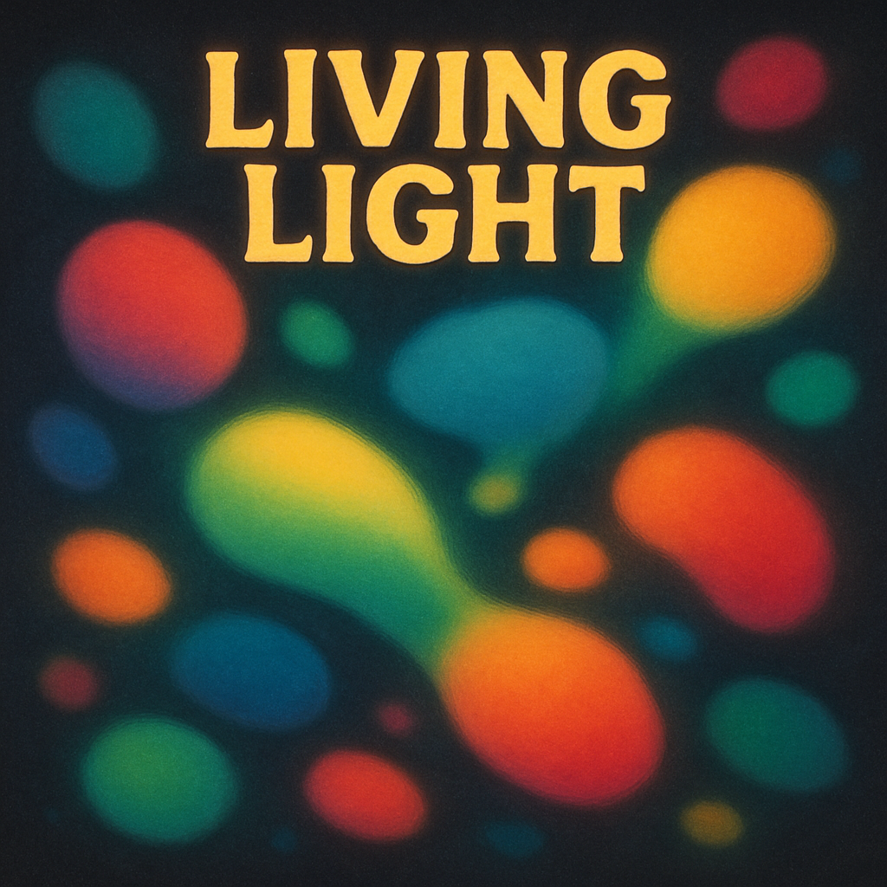

# Blobs Scene

## Description

This scene simulates soft, colorful, circular "blobs" moving across the surface of the 3D model. Blobs have varying sizes and lifetimes, gently fade in when created, and push each other away slightly when they get too close.

## Parameters

-   `num_blobs` (count, 1-20, default: 8): The number of active blobs.
-   `min_radius` (count, 10-100, default: 70): The minimum radius a blob can have.
-   `max_radius` (count, 50-200, default: 130): The maximum radius a blob can have.
-   `max_age` (count, 500-10000, default: 4000): The maximum lifetime (in frames) before a blob resets.
-   `speed` (ratio, default: 0.25): A multiplier affecting the general movement speed of the blobs.
-   `fade` (count, 1-20, default: 8): The amount LEDs fade each frame. Higher values mean shorter trails/less persistence.

## Implementation Notes

-   **Classes:** The scene uses a `BlobScene` class to manage a collection of `Blob` objects (defined in `blob.h`/`.cpp`). Each `Blob` instance handles its own position, velocity, radius, age, and color.
-   **Movement:** Blobs move in 3D Cartesian space. Their position is updated based on their velocity each frame. Velocity seems primarily influenced by initial randomization and the repulsion force.
-   **Repulsion:** The `BlobScene` calculates pairwise distances between blobs. If two blobs are closer than their combined radii, a repulsion force is applied to push them apart.
-   **Rendering:**
    -   Each blob is rendered as a soft circular area.
    -   LEDs within the blob's `radius` are affected.
    -   The blob's color is blended onto the LED using `nblend`.
    -   The blend amount falls off smoothly from the center to the edge using an eased calculation based on distance.
-   **Color:** Each blob is assigned a random, vibrant color (`CHSV(random8(), 255, 255)`) when initialized.
-   **Lifecycle:**
    -   Blobs have a maximum `age` (in frames).
    -   When a blob is created or resets (likely when `age > max_age`), it quickly fades in over `FADE_IN_DURATION` frames.
    -   The `Blob::tick()` method handles aging and presumably resetting the blob's state (position, velocity, radius, age) when it expires. 