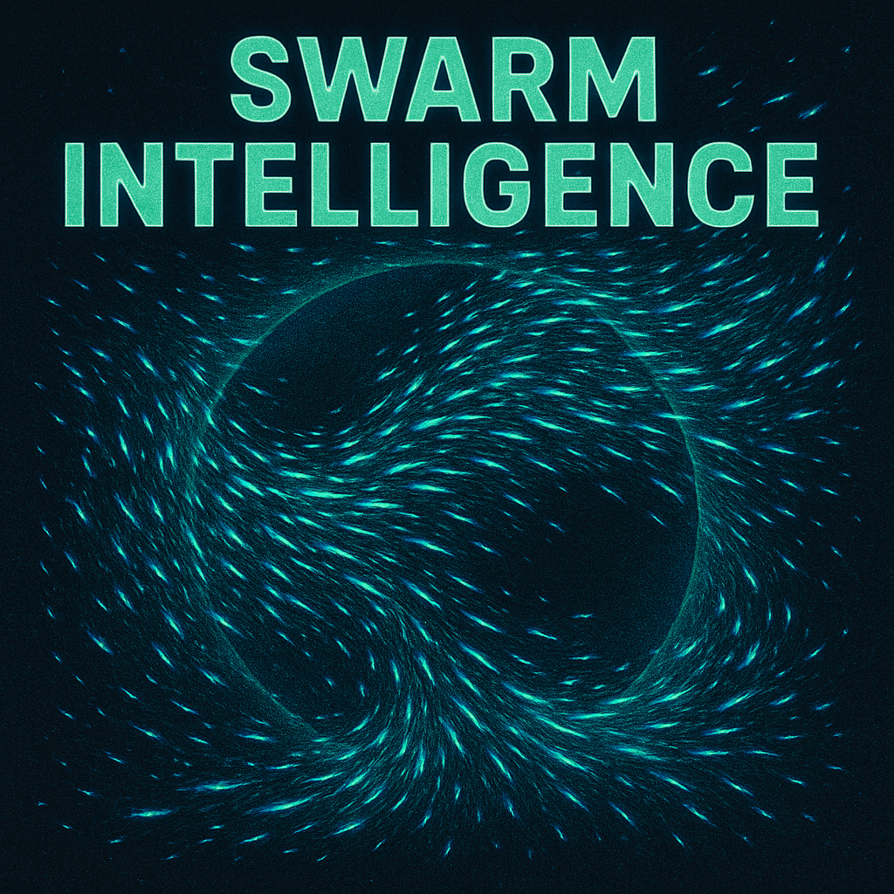

# Boids Scene

## Description

This scene simulates the classic "boids" flocking behavior on the surface of the 3D model (conceptually treated as a sphere). Multiple agents (boids) move according to simple rules based on their neighbors, creating complex and emergent group motion.

## Parameters

-   `num_boids` (count, 10-200, default: 80): The number of boids in the simulation.
-   `visual_range` (range, 0.1-2.0, default: 0.4): The angular distance (in radians on the sphere) within which a boid considers other boids as neighbors for alignment and cohesion.
-   `protected_range` (range, 0.05-1.0, default: 0.35): The minimum angular distance (radians) boids try to maintain from each other (separation rule).
-   `centering_factor` (range, 0.0-1.0, default: 0.1): The strength of the force pulling a boid towards the perceived center of its neighbors (cohesion rule).
-   `avoid_factor` (range, 0.0-1.0, default: 0.75): The strength of the force pushing a boid away from neighbors that are too close (within `protected_range`). Separation rule.
-   `matching_factor` (range, 0.0-1.0, default: 0.1): The strength of the force steering a boid to match the average heading of its neighbors (alignment rule).
-   `speed_limit` (range, 1.0-15.0, default: 6.0): The maximum speed a boid can travel.
-   `fade` (count, 1-100, default: 30): The amount LEDs fade each frame, creating trails behind the boids. Higher values mean shorter trails.
-   `chaos` (range, 0.0-1.0, default: 0.55): Introduces occasional random force nudges to individual boids, disrupting perfect flocking. Higher values increase the frequency/strength of these nudges.
-   `intensity` (range, 0.1-1.0, default: 0.6): Multiplier controlling the brightness when rendering boids onto LEDs.

## Implementation Notes

-   **Algorithm:** Implements the three classic boid rules:
    1.  **Separation:** Steer to avoid crowding local flockmates (within `protected_range`).
    2.  **Alignment:** Steer towards the average heading of local flockmates (within `visual_range`).
    3.  **Cohesion:** Steer to move toward the average position of local flockmates (within `visual_range`).
-   **Movement:** Boids move in 3D Cartesian space but their velocity is constrained to be tangential to the sphere surface defined by the model's radius, keeping them "on the surface". Positions are updated based on velocity each frame.
-   **Distance:** Neighbor checks use spherical angular distance (`acos(dot(pos1_norm, pos2_norm))`).
-   **Rendering:** Each boid is rendered as a single point of light by finding the closest LED to its current 3D position and blending its color onto that LED using `nblend`. The brightness is scaled by the `intensity` parameter.
-   **Color:** Boids are assigned colors sampled from the `OceanColors` palette upon initialization.
-   **Parameter Changes:** The scene monitors `num_boids`, `speed_limit`, and `chaos` parameters and re-initializes or updates the boids accordingly if they change during runtime. 