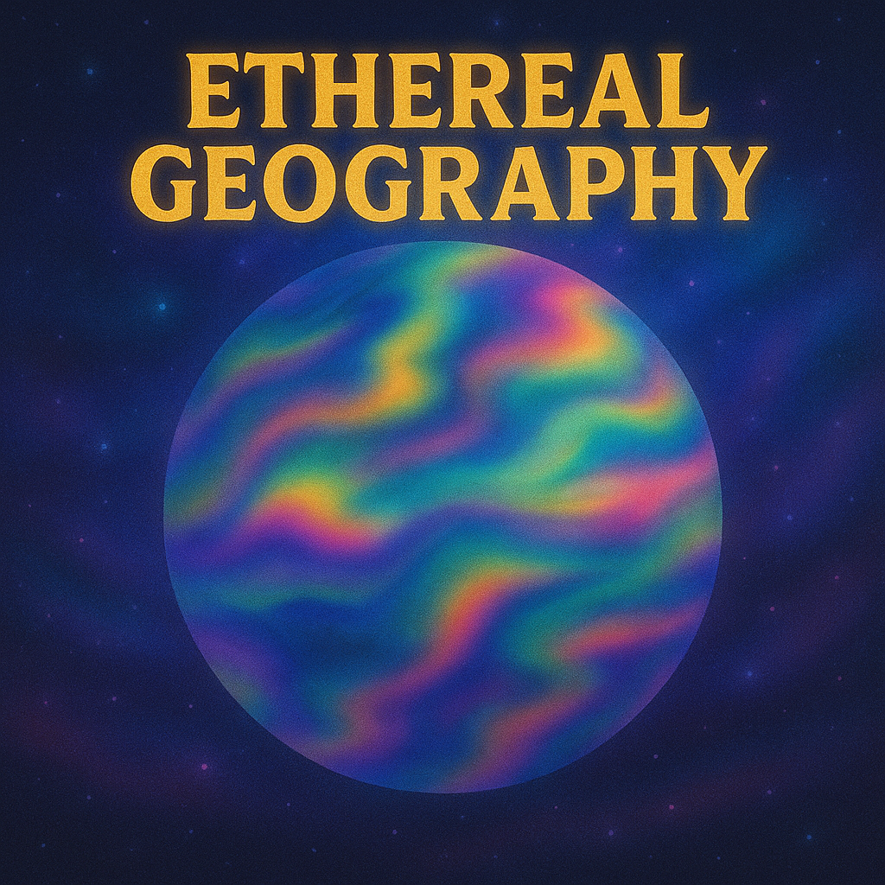

# Geography Scene

## Description

This scene maps a 2D texture onto the 3D model, simulating a rotating sphere (like a planet). It allows selecting different textures (e.g., Earth Day, Earth Night, Blue Marble) and controlling the rotation speed and overall brightness.

## Parameters

-   `texture_index` (enum/int, default: 0): Selects which texture map to display. The available textures are hardcoded (currently Earth Day, Earth Night, Blue Marble).
-   `rotation_speed` (range, -2.0 to 2.0, default: 0.1): Controls the speed and direction of the sphere's rotation around its vertical (Y) axis. Positive values rotate one way, negative values the other.
-   `brightness` (ratio, 0.0-1.0, default: 1.0): Adjusts the overall brightness of the displayed texture.

## Implementation Notes

-   **Textures:** The scene pre-loads several texture maps (defined elsewhere, likely as C arrays) into memory during `setup()`.
-   **Rotation:** The scene maintains a `rotation_angle` which is updated each frame based on the `rotation_speed` parameter and `deltaTime()`.
-   **Coordinate Mapping:**
    *   For each LED, its 3D Cartesian coordinates (`x`, `y`, `z`) are retrieved from the model.
    *   These coordinates are treated as points on a sphere.
    *   The current global `rotation_angle` is applied (conceptually rotating the viewpoint or the sphere around the Y-axis).
    *   The (rotated) Cartesian coordinates are converted to spherical coordinates (longitude `lon`, latitude `lat`).
    *   The spherical coordinates are mapped to 2D texture coordinates (`u`, `v`), typically ranging from 0.0 to 1.0.
-   **Texture Sampling:** The `texture2Dlookup` function (defined elsewhere) is used to sample the color from the selected texture map at the calculated (`u`, `v`) coordinates. Bilinear filtering might be applied by the lookup function for smoother results.
-   **Rendering:** The sampled texture color is scaled by the `brightness` parameter and then assigned directly to the corresponding LED (`leds[i] = sampled_color`). There is typically no blending involved, as the texture covers the entire surface. 