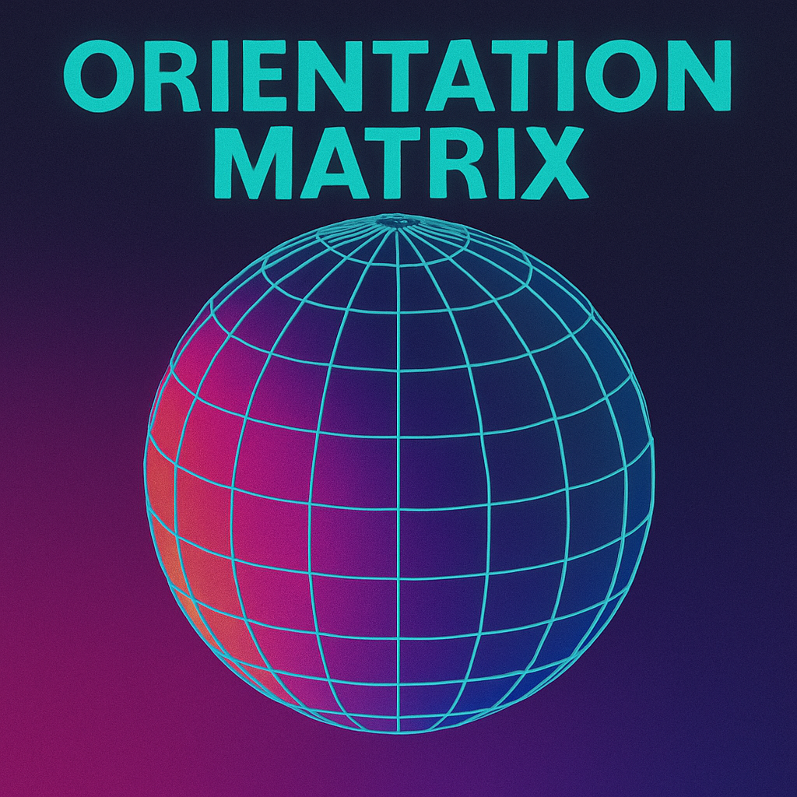

# Orientation Grid Scene

## Description

This scene displays a spherical grid (lines of latitude and longitude) projected onto the 3D model. The grid rotates dynamically with varying tilt and tumble. The colors of the grid lines and the background transition smoothly between randomly chosen high-contrast pairs over time.

## Parameters

-   `latitude_lines` (count, 2-20, default: 5): Number of latitude lines (circles parallel to the equator).
-   `longitude_lines` (count, 2-20, default: 4): Number of longitude lines (circles passing through the poles).
-   `cycle_time_frames` (count, 100-5000, default: 1500): Number of frames between the start of color transitions.
-   `transition_duration_frames` (count, 50-1000, default: 200): Number of frames over which the color transition occurs.
-   `line_width` (range, 0.02-0.5, default: 0.14): Thickness of the grid lines relative to the distance from the center.

## Implementation Notes

-   **Coordinate System:** The scene simulates a grid on a conceptual sphere.
-   **Rotation:** A combined rotation matrix is calculated each frame based on:
    *   A constant `spin` around the Z-axis.
    *   An oscillating `tilt` around the X-axis (driven by a sine wave).
    *   A slower `tumble` around the Y-axis.
-   **Grid Calculation:**
    *   For each LED, its 3D position is rotated using the combined rotation matrix.
    *   The rotated position is converted to spherical coordinates (azimuth and elevation).
    *   The angular distance to the nearest latitude and longitude line is calculated.
    *   The minimum of these angular distances determines the LED's proximity to the grid.
-   **Rendering:**
    *   LEDs are initially set to the current background color (`bg_color_`).
    *   If an LED is close to a grid line (distance < calculated `line_thickness_world`), its color is blended towards the current line color (`line_color_`) using an eased blend factor.
-   **Color Transitions:**
    *   The scene cycles between a dark background/bright lines and a bright background/dark lines (`dark_lines_` flag flips).
    *   Every `cycle_time_frames`, `pickNewColors()` selects a new pair of target colors (`target_bg_color_`, `target_line_color_`) from palettes, ensuring good hue separation and brightness contrast.
    *   The transition between the previous colors and the target colors occurs over `transition_duration_frames`, using eased interpolation for both color and `line_width`.
-   **Rotation Speed Variation:** The base rotation speed is increased during color transitions for added visual effect. 