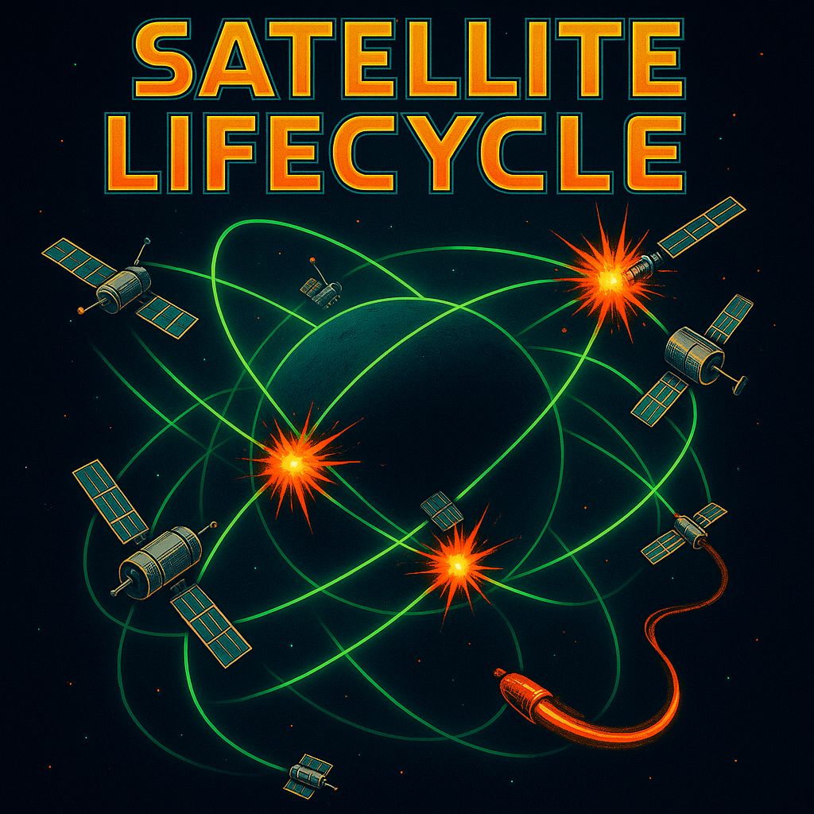

# Satellites

Multiple satellites orbit the model surface. Collisions trigger a crash sequence.

## Parameters

- `population` (1-200, default: 18): Number of satellites.
- `speed` (0.1-5.0, default: 1.7): Overall speed multiplier for satellite orbital motion.
- `chaos` (0.0-1.0, default: 0.2): Likelihood and magnitude of random perturbations to satellite orbits.
- `trails` (0.0-1.0, default: 0.7): Controls the fade amount per frame. Higher values mean *less* fading and longer visual trails.
- `render_radius` (0.01-0.3, default: 0.085): Angular size of the rendered satellite "head".
- `blur` (0.0-1.0, default: 0.0): Strength of the optional spatial blur post-processing effect.

## Implementation Notes

**State Machine:** Each satellite follows a simple state machine:
- `Dead`: Waiting for `RESPAWN_DELAY` timer.
- `Spawning`: Fades in (Grey -> Green) while accelerating outwards and along its path over `SPAWN_DURATION`.
- `Orbiting`: Moves along its defined orbital path at its set `angularSpeed` (scaled by `speed` param). Path parameters (`orbitAxis`, `angularSpeed`) are occasionally nudged by `chaos`.
- `Crashing`: Triggered immediately by a collision. Color fades (OrangeRed -> Grey), angular speed slows quadratically over `CRASH_DURATION` before transitioning to `Dead`.

**Orbital Paths:** Each satellite follows a circular path on the sphere surface.
- The path's orientation is defined by a random `orbitAxis` (normalized vector).
- Position is calculated by rotating a reference vector (`orbitRefVec`) around the `orbitAxis` by the current `phaseAngle` (using Rodrigues' rotation formula) and scaling to `BASE_ORBITAL_RADIUS`.
- `angularSpeed` controls how fast `phaseAngle` changes.
- `chaos` introduces small random changes to `orbitAxis` and `angularSpeed` over time.

**Collisions:**
- Detected when the Cartesian distance between two satellites (`Orbiting` state) is less than `COLLISION_PROXIMITY`.
- Effect: Generates sparks at the impact point and *immediately* transitions both satellites to the `Crashing` state.

**Rendering:**
- Satellites are rendered based on angular proximity. LEDs within `render_radius` of the satellite's normalized position are lit.
- Brightness falls off quadratically from the center to the edge of the render radius.
- Color is determined by state: Grey (Spawning), Green (Orbiting), OrangeRed fading to Grey (Crashing).
- No explicit tail rendering is performed (trails are created by pixel fade persistence).

**Sparks:**
- Generated only on collision.
- Start Red, fade to Yellow over their lifetime.
- Spawn at the collision midpoint and drift slowly outwards in random directions.
