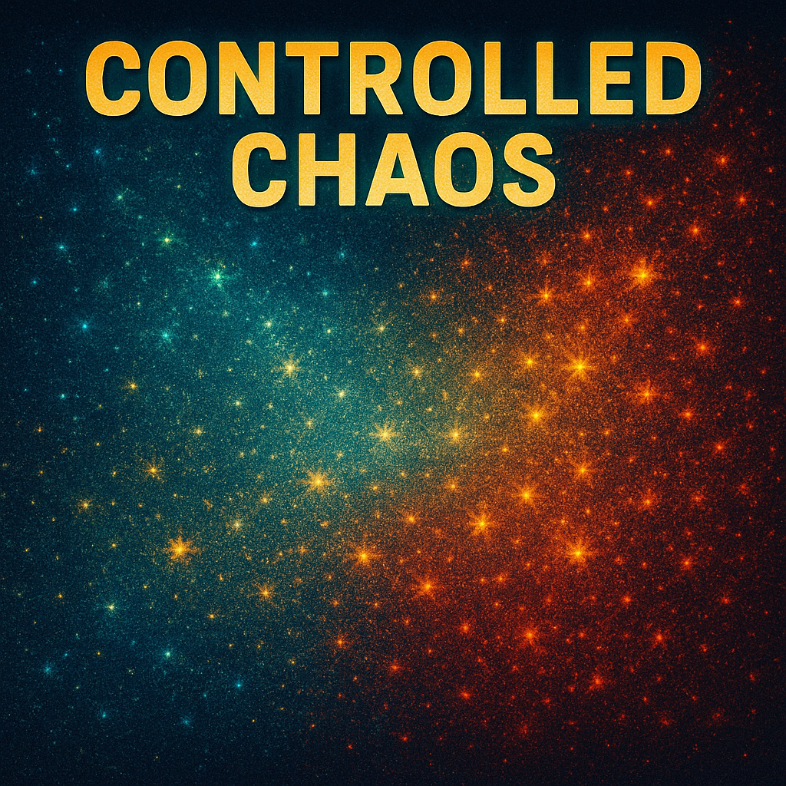

# Sparkles Scene

## Description

This scene creates a shimmering, sparkling effect using two primary colors drawn from separate palettes. These colors transition independently over time. Pixels are randomly "sparkled" using additive blending with these colors, creating a dynamic, evolving texture. The overall intensity, color mix, transition speed, sparkle behavior, and randomness are controlled by parameters.

## Implementation Strategy

Parameters:

-   **Speed**: (Ratio 0.0-1.0, Default: 0.5) Controls the base frequency of color transitions and the speed of the color mix oscillation. Higher speed means faster changes.
-   **Glitter**: (Ratio 0.0-1.0, Default: 0.5) Affects the amplitude of the color mix oscillation (how strongly the mix favors one color) and the brightness variation applied to individual sparkles. Higher glitter means more pronounced mix shifts and brighter/dimmer sparkles.
-   **Chaos**: (Ratio 0.0-1.0, Default: 0.5) Introduces randomness into color transition durations and the mix oscillation pattern. Higher chaos leads to more unpredictable timing and mixing.
-   **Intensity**: (Ratio 0.0-1.0, Default: 0.5) Controls the overall density of sparkles (number of pixels updated per frame) and the global fade rate. Higher intensity means more active pixels and less fading (longer trails).

State Tracking:

-   `colorA`, `colorB`: Current transitioning `CRGB` values being displayed.
-   `colorATarget`, `colorBTarget`: Target `CRGB` values for the *next* transition cycle.
-   `previousColorATarget`, `previousColorBTarget`: Target `CRGB` values from the *previous* transition cycle (used as the starting point for lerping).
-   `palette1`, `palette2`: Assigned `CRGBPalette16` (defaults: `CloudColors_p`, `HeatColors_p`).
-   `colorChangeTimer`: Countdown (seconds) until the *end* of the current transition cycle for both colors.
-   `colorATransitionDuration`, `colorBTransitionDuration`: Duration (seconds) assigned to the *current* transition cycle for each color. Randomized by Chaos.
-   `mixOscillatorPhase`: Current phase (radians) for the mix ratio calculation. Influenced by Speed and Chaos.

Algorithm:

1.  **Initialization (`setup`)**:
    *   Define metadata (Name, Author, Description, Version).
    *   Define Parameters (Speed, Glitter, Chaos, Intensity) with defaults and ranges.
    *   Copy palettes (`CloudColors_p`, `HeatColors_p`) from PROGMEM into member variables (`palette1`, `palette2`).
    *   Set initial colors (`colorA`, `colorB`) and previous targets (`previousColor...`) to `CRGB::Black`.
    *   Select the *first* `colorATarget` and `colorBTarget` randomly from palettes using `selectNewColorFromPalette`.
    *   Calculate the *first* transition durations (`colorATransitionDuration`, `colorBTransitionDuration`) based on `Speed` and `Chaos`.
    *   Set the initial `colorChangeTimer` to ensure at least a 3-second fade-in (`max({3.0f, durationA, durationB})`).
    *   Initialize `mixOscillatorPhase` randomly.
    *   Log setup completion.

2.  **Update Loop (`tick`)**:
    *   Get `dt` (delta time) using `deltaTime()`.
    *   **Global Fade**: Apply a fade to all pixels using a per-LED loop: `leds[i].fadeToBlackBy(fadeAmount)`, where `fadeAmount` is calculated based on `Intensity`.
    *   **Color Transition Timing**:
        *   Decrement `colorChangeTimer` by `dt`.
        *   If `colorChangeTimer <= 0`, call `startNewColorTransition()`:
            *   Store current targets (`colorATarget`, `colorBTarget`) as previous targets (`previousColor...`).
            *   Choose *new* `colorATarget` and `colorBTarget` randomly from palettes.
            *   Calculate *new* `colorATransitionDuration` and `colorBTransitionDuration` based on `Speed` and `Chaos`.
            *   Reset `colorChangeTimer` to `max(colorATransitionDuration, colorBTransitionDuration)`.
    *   **Color Transition Calculation**:
        *   Calculate `timeRemaining = max(0.0f, colorChangeTimer)`.
        *   Calculate `progressA` and `progressB` (0.0 to 1.0) indicating how far each color is through its *current* transition based on `timeRemaining` and its respective `Duration`. Handles division by zero if duration is very small.
        *   Update current `colorA` and `colorB` by interpolating: `colorA = lerpColor(previousColorATarget, colorATarget, progressA)` (and similarly for B).
    *   **Calculate Mix Ratio**:
        *   Call `calculateMixRatio()` which:
            *   Updates `mixOscillatorPhase` based on `Speed`, `Chaos`, and `dt`.
            *   Calculates a `baseMixRatio` using `sin(mixOscillatorPhase)`.
            *   Applies noise based on `Chaos` and scales the amplitude based on `Glitter`.
            *   Clamps the final `mixRatio` to the range [0.0, 1.0].
    *   **Pixel Sparkles**:
        *   Get `Intensity` parameter.
        *   Calculate `numTotalSparkles` based on `Intensity * Intensity * ledCount() * 0.3f`.
        *   Calculate `sparkleStrength` based on `Intensity`.
        *   Distribute total sparkles between A and B: `numSparklesA = round(numTotalSparkles * mixRatio)`, `numSparklesB = round(numTotalSparkles * (1.0 - mixRatio))`.
        *   Loop `numSparklesA` times:
            *   Choose a random pixel index `px` using `random16() % ledCount()`.
            *   Calculate `brightnessVariation` using `calculateSparkleBrightness()`.
            *   Copy `colorA` to `variedColorA`.
            *   Scale `variedColorA` by `brightnessVariation` using `nscale8`.
            *   Additively blend onto the pixel: `leds[px] += variedColorA.nscale8(sparkleStrength)`. (Uses `CRGB +=` operator).
        *   Loop `numSparklesB` times (similarly for color B).

Helper Calculations & Functions:

-   `selectNewColorFromPalette(palette)`: Returns `colorFromPalette(palette, random8())`.
-   `calculateBaseTransitionDuration()`: Returns duration (seconds) based on `Speed` (e.g., 2s to 10s).
-   `randomizeDuration(baseDuration)`: Returns `baseDuration` multiplied by a factor randomized by `Chaos` (e.g., `* (1.0 +/- Chaos*0.5)`), ensuring a minimum duration.
-   `lerpColor(start, end, factor)`: Performs component-wise 8-bit linear interpolation between two `CRGB` colors using `lerp8by8`.
-   `calculateFadeAmount()`: Maps `Intensity` (0.0-1.0) to a fade value (e.g., `5 + (1-Intensity)*20`), lower intensity = more fade.
-   `calculateSparkleStrength()`: Maps `Intensity` (0.0-1.0) to a scaling factor for additive blending (e.g., 64 to 255).
-   `calculateMixRatio()`: Updates internal `mixOscillatorPhase` based on `Speed`/`Chaos`/`dt` and returns a blend ratio [0.0, 1.0] influenced by `Glitter` and `Chaos`.
-   `calculateSparkleBrightness()`: Returns a brightness scaling factor (0-255) based on `Glitter` and a slow sine wave variation driven by `millis()` and `mixOscillatorPhase`.

