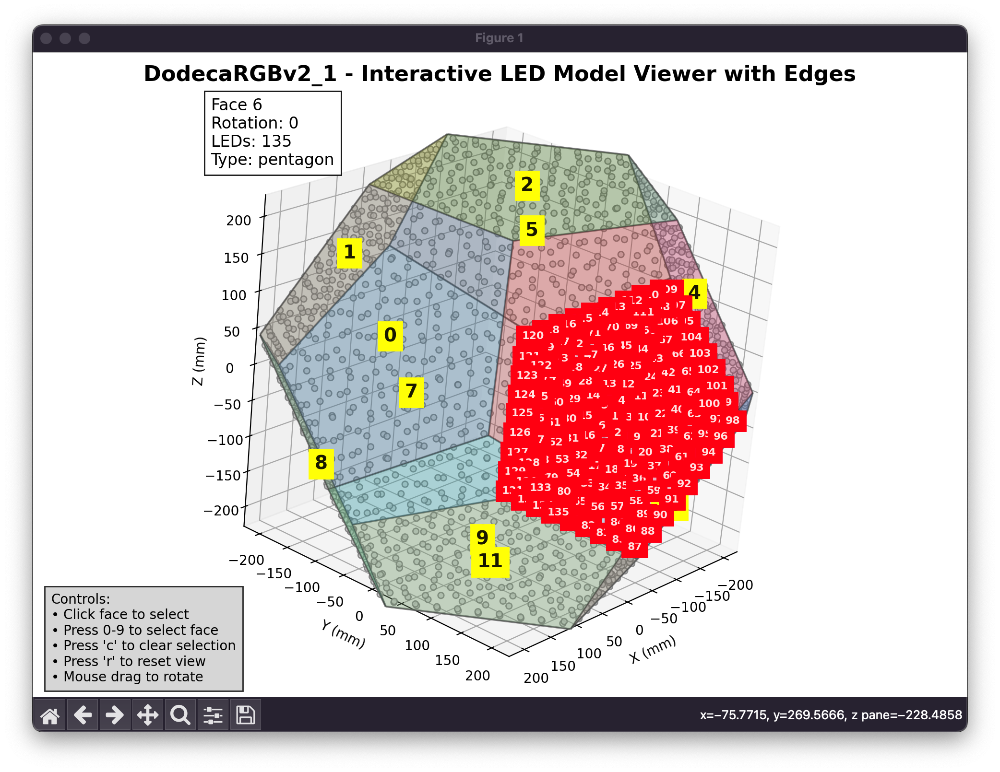

# Python Utilities

Tools for model generation and development.

## Setup

```bash
pip install -r requirements.txt
```

## Tools

### Model Generation
```bash
# Generate model from YAML definition and PCB pick-and-place data
python util/generate_model.py -d <model_dir>

# Options:
# -m, --model MODEL       Path to model YAML definition file
# -d, --model-dir DIR     Path to model directory containing model.yaml and pcb/*.pos
# -o, --output FILE       Output file (default: model.h in model directory)
# -f, --format FORMAT     Output format: cpp or json (default: cpp)
# -i, --input FILE        Input PCB pick and place file (overrides YAML definition)
# -y, --yes               Automatically overwrite existing files without confirmation

# Example:
python util/generate_model.py -d src/models/DodecaRGBv2
```

### Testing
```bash
python -m util.tests.run_tests
```

### 3D Model Viewer
```bash
# Interactive 3D model visualization
python util/dodeca_viewer.py <model_directory>
```

See [Model Visualization](#model-visualization) section below for detailed usage.

## Implementation Notes

- `Matrix3D`: Python port of Processing transformation matrix
- `test_transforms.pde`: Original Processing reference code
- Point data generation matches hardware PCB layout:
  - 12 pentagon PCBs (104 LEDs each)
  - ~13cm diameter dodecahedron
  - Verified against physical measurements

## Model Generation Process

A model is made up of multiple PCBs of the same kind. Each face of a model is defined by a shape, and a pick-and-place CSV file specifies the XY coordinates of all leds on that PCB. Using this information we construct the model in virtual 3d space, and find the coordinates of all leds and the geometry of the model. This is then used to generate a C header file with all of the data needed to animate the leds using the PixelTheater library.

The model generation process:

1. Reads a YAML model definition file that specifies face types, face instances, and model metadata
2. Loads PCB pick-and-place data to get LED positions
3. Calculates the edges and geometry of the model
4. Transforms LED positions based on face positions and rotations
5. Calculates neighbor relationships between LEDs
6. Generates a C++ header file with the complete model definition

### Face Remapping

When the physical wiring order doesn't match the geometric layout, you can use face remapping to correct the positioning:

```yaml
faces:
  - id: 0           # Logical face ID (wiring order)
    type: pentagon
    remap_to: 2     # Use geometric position of face 2
    rotation: 1
  - id: 1
    type: pentagon
    rotation: 1
  - id: 2
    type: pentagon
    remap_to: 0     # Use geometric position of face 0
    rotation: 1
```

In this example:
- Face 0 (first in wiring) uses the geometric position where face 2 should be
- Face 2 (third in wiring) uses the geometric position where face 0 should be
- The `face_id` in the generated model preserves the logical wiring order
- The 3D positioning uses the remapped geometric locations

See [Model.md](../docs/PixelTheater/Model.md) for more details on the model system.


## Model Visualization

Interactive 3D visualization tool for verifying and configuring generated LED models.



### Usage

```bash
# View model (requires model.json - generate with -f json flag)
python util/dodeca_viewer.py src/models/DodecaRGBv2_1

# Show model info only
python util/dodeca_viewer.py src/models/DodecaRGBv2_1 --info
```

Controls: Click faces to select, drag to rotate, press 'r' to reset view.

### Requirements

- `matplotlib` (3D plotting)
- `numpy` (included in `requirements.txt`)

### Use Cases

- Verify LED positioning and face geometry
- Debug face remapping and rotations
- Understand 3D structure for scene development
