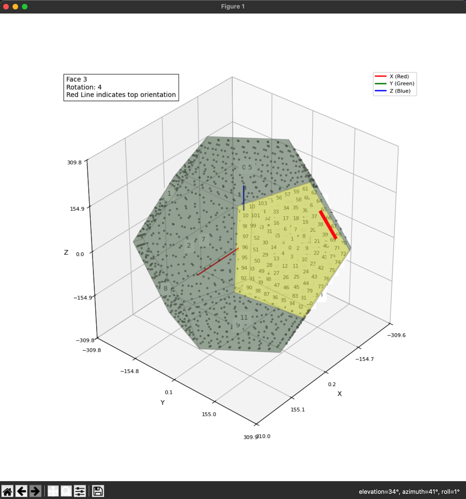

# DodecaRGB Utilities

This directory contains Python utilities for the DodecaRGB project, including tools for:

- Constructing the model and LEDs in 3D space
- Importing PCB pick-and-place files for LED placement
- Calculating and validating LED coordinates and neighbor distances
- Exporting LED coordinates to a C++ file (and JSON file)

The original Processing code that was used to generate the LED coordinates is in the `test_transforms.pde` file.

The Matrix3D class is a Python implementation of the 3D transformation matrix operations used in the Processing. It includes a test suite and was verified against the Processing code.

## Dependencies

### Python Environment Setup

Install required Python packages:

```bash
pip install -r requirements.txt
```

This will install all dependencies needed for:

- Code generation utilities
- 3D visualization tools
- Development tools (linting, testing)

## Usage

### Python Tests

To run the tests:

```bash
python -m util.tests.run_tests
```

### Scene Code Generation and YAML Parsing

To generate the scene code and parse the YAML file:

```bash
python generate_scene.py -h   # for help
```

### Pick-and-Place File Parsing (Point Data Generation)

To parse the pick-and-place file and calculate all the LED position data:

```bash
python generate_points.py -h   # for help
python generate_points.py       # outputs Point data to terminal
python generate_points.py -f json -o data/points.json    # outputs Point data to terminal and json file
```

### 3D Visualizer

To use the visualizer:

```bash
python visualizer.py
```

This app shows the arrangement of all the PCBs and their orientation. When using the visualizer, you can click and drag the mouse to rotate the view. Clicking on a specific face will hightlight all the LEDs number on that PCB. Note that you must have the `tk` library installed to run the app. 

